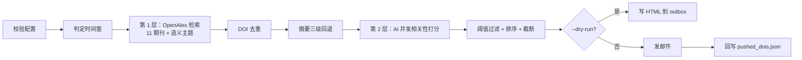

# 顶刊文献自动推送机器人

每周三晚自动检索 11 本材料/能源/化学顶刊的最新论文，用 AI 判断是否与**你配置的研究方向**
相关，只把真正相关的文献整理成中文周报邮件发到你的邮箱。

> 🚀 **第一次用？** 直接看 [部署到 GitHub（完整流程）](#部署到-github完整流程)
> —— 从装 Git 到收到第一封邮件，6 步走完，全程约 20 分钟。

> **换课题只需改 `src/config.py` 里的一段配置**（`RESEARCH_FIELD` / `RESEARCH_DESCRIPTION` /
> `USER_KEYWORDS` / `TOPIC_QUERY`），代码不用动。详见 [如何换研究方向](#如何换研究方向)。

筛选分**两层**，各司其职：

| 层级 | 手段 | 作用 | 实测候选量 |
|---|---|---|---|
| 第 1 层 | OpenAlex 的**语义主题** `topics.id` | 按研究方向捞出**可能相关**的全部论文 | ~194 篇 / 30 天 |
| 第 2 层 | AI 逐篇打分（0–100），低于阈值丢弃 | 按**你的具体兴趣**做精读判断 | ~20 篇入选 |

> AI **不负责关键词匹配**。它拿到的是第 1 层已经筛过的候选集，再做一轮语义相关性打分。

- 检索：**OpenAlex**（无需 API Key，免费）
- 筛选：任意 **OpenAI 兼容** 的 AI 接口（默认 DeepSeek `deepseek-chat`）
- 邮件：SMTP（QQ / Gmail / 163 / Outlook…）
- 调度：**GitHub Actions**（仓库自带 workflow，无需服务器）

---

## 目录结构

```
.
├── .github/workflows/weekly_push.yml   # 定时任务（每周三 23:07 北京时间）
├── src/
│   ├── config.py                       # ★所有"可能要改"的参数（研究方向、期刊、阈值）
│   ├── logger.py                       # 日志初始化（时区正确、幂等）
│   ├── openalex_client.py              # 第 1 层检索：拼查询 + 分页 + 解析 + 主题自动解析
│   ├── abstract_source.py              # 摘要三级回退：OpenAlex → Crossref → S2
│   ├── ai_matcher.py                   # 第 2 层：AI 并发打分 + 稳健 JSON 解析
│   ├── dedup.py                        # DOI 去重 + 运行状态持久化
│   ├── mailer.py                       # HTML 渲染 + SMTP 发送
│   └── main.py                         # 主流程编排 + 命令行
├── tests/test_core.py                  # 52 个单元测试（锁定高风险修复）
├── data/
│   ├── pushed_dois.json                # 去重状态（唯一需要提交的文件）
│   ├── topics_cache.json               # 语义主题解析缓存（已 gitignore，自动重建）
│   ├── logs/                           # 运行日志（已 gitignore，Actions 里传 artifact）
│   └── outbox/                         # --dry-run 生成的 HTML 预览（已 gitignore）
├── requirements.txt
└── README.md
```

---

## 部署到 GitHub（完整流程）

> 目标：代码躺在 GitHub 上，GitHub Actions 每周三 23:07（北京时间）自动跑一次并把邮件发出去。
> **全程只做一次，之后不用管。**

### 第 0 步：装 Git

先确认本机有没有：

```powershell
git --version
```

如果报「无法将"git"项识别为 cmdlet…」，说明 Git 还没装。二选一：

| 方案 | 下载 | 说明 |
|---|---|---|
| **Git for Windows**（推荐） | <https://git-scm.com/download/win> | 一路「下一步」即可。会自带 Git Credential Manager，**首次 push 弹浏览器登录，不用手动建 Token** |
| **GitHub Desktop** | <https://desktop.github.com> | 图形界面，适合完全不想碰命令行的人 |

装完**重开终端**（PATH 才会刷新），再验证一次 `git --version`。

### 第 1 步：先本地跑通预览

推上 GitHub 之前，先在本地确认代码能跑。这一步不需要任何 Secret：

```bash
python -m pip install -r requirements.txt
python -m src.main --dry-run --no-ai --verbose
```

执行完打开 `data/outbox/<日期>.html` 就能看到邮件长什么样。
`--dry-run` **完全无副作用**：不发邮件、不改 `data/pushed_dois.json`。

> 只有这一步跑通了再往下走。否则推到 GitHub 后报错，你还得在 Actions 日志里排查，
> 比本地难看得多。

### 第 2 步：在 GitHub 建一个空仓库

1. 打开 <https://github.com/new>
2. **Repository name** 填一个名字，例如 `weekly-literature-push`
3. **Public / Private 都行**，区别见下表
4. ⚠️ **不要**勾选 "Add a README file" / ".gitignore" / "license"
   —— 本地已经有这些文件了，勾了会导致 push 冲突，还得手动 merge
5. 点 **Create repository**

| | Public | Private |
|---|---|---|
| Actions 免费额度 | 无限 | 2000 分钟/月（本任务每周约 1–2 分钟，够用） |
| 60 天无活动 | 定时任务被自动暂停 | **不会**被暂停 |

> 本仓库不含任何密钥（全部走 Secrets），所以 Public 也是安全的。
> 若你更在意隐私就用 Private，配额绰绰有余。

### 第 3 步：把本地代码推上去

在项目根目录（`e:\学习\研一上学期\文献自动推送`）开一个终端：

```bash
git init -b main
git add .
git status
git commit -m "feat: 顶刊文献自动推送机器人"
git remote add origin https://github.com/<你的用户名>/weekly-literature-push.git
git push -u origin main
```

> **★ 为什么必须先看一眼 `git status`**
>
> `.gitignore` 已经把 `.venv/`（几百 MB）、`data/logs/`、`data/outbox/`、
> `data/topics_cache.json`、`.vscode/`、`.env` 全部排除掉了。
> 但你要**亲自确认**列表里没有它们。
>
> 一旦把 `.venv/` 推上去，仓库会瞬间膨胀几百 MB；
> 一旦把 `.env` 推上去，密钥就泄露了 —— **而且即使删掉文件，它依然留在 git 历史里**，
> 只能靠重写历史或删库重建来补救。
>
> 正常应该只看到这些（约 15 个文件）：
> `.github/workflows/weekly_push.yml`、`.gitignore`、`README.md`、`requirements.txt`、
> `requests.md`、`src/*.py`、`tests/test_core.py`、`data/pushed_dois.json`

首次 `git push` 会要求认证：

- **装了 Git Credential Manager**（Git for Windows 自带）→ 弹出浏览器 → 点授权即可
- **没有** → 用 Personal Access Token 当密码：
  GitHub → Settings → Developer settings → Personal access tokens → Fine-grained tokens
  → 勾 `Contents: Read and write` → 生成后复制，粘贴到密码框

> ⚠️ **默认分支必须是 `main`**。GitHub Actions 的定时任务**只在默认分支上生效**，
> 而且要求 workflow 文件已经存在于默认分支。
> 所以别推到一个叫 `master` 的分支然后指望定时任务会跑。
> （如果你已经推错了：仓库 Settings → Branches → 把默认分支改成 `master`，
> 或者本地 `git branch -m master main` 后重新 push。）

### 第 4 步：配置 Secrets

打开仓库页 **Settings → Secrets and variables → Actions → New repository secret**，
依次添加下面 9 个（本地调试时可改成环境变量）：

| Secret | 必填 | 说明 | 示例 |
|---|---|---|---|
| `OPENALEX_MAILTO` | 建议 | 你的邮箱，OpenAlex 会把你放进**礼貌池**（更快、更稳）。留空则复用 `SMTP_USER` | `you@example.com` |
| `AI_BASE_URL` | ✅ | OpenAI 兼容端点 | `https://api.deepseek.com/v1` |
| `AI_API_KEY` | ✅ | AI 平台的 API Key | `sk-xxxxxxxx` |
| `AI_MODEL` | ✅ | 模型名 | `deepseek-chat` |
| `SMTP_HOST` | ✅ | 发信服务器 | `smtp.qq.com` |
| `SMTP_PORT` | ✅ | 端口（465 走 SSL，587/25 走 STARTTLS，脚本自动选择） | `465` |
| `SMTP_USER` | ✅ | 发信邮箱账号 | `you@qq.com` |
| `SMTP_PASS` | ✅ | **授权码 / App Password**，不是登录密码！ | `abcdefghijklmnop` |
| `MAIL_TO` | ✅ | 收件人，多个用逗号或分号分隔 | `a@x.com;b@y.com` |

> **关于 `SMTP_PASS`**：QQ/163 邮箱在「设置 → 账户 → POP3/SMTP服务」开启后生成**授权码**；
> Gmail 需要开启两步验证后生成 **App Password**。填登录密码一定会认证失败。

### 第 5 步：手动触发一次验证

代码推上去、Secrets 填好之后：

1. 打开仓库页的 **Actions** 标签
2. 左侧列表点 `weekly-literature-push`
3. 右上角 **Run workflow** → 把 `dry_run` 勾上 → 点绿色的 Run
4. 等 1–2 分钟跑完，进这次 run 的页面，拉到底部 **Artifacts** 下载
   `email-preview-*`，解压打开 HTML 检查效果（这一步不会发信）

确认 HTML 没问题后，再跑一次**不勾** `dry_run` 的：

- 这次会真的发邮件到 `MAIL_TO`
- 并把 `data/pushed_dois.json` 自动提交回仓库（commit 信息类似
  `chore: update pushed DOIs 2026-09-16`）

> **看不到 `Run workflow` 按钮？** 说明 workflow 文件不在默认分支上
> —— 回第 3 步确认你推的是哪个分支。
> 私有仓库还需确认 **Settings → Actions → General** 里没有禁用 Actions。

### 第 6 步：定时任务

**不用做任何事**，它已经配好了：

```yaml
on:
  schedule:
    - cron: "7 23 * * 3"        # 每周三 23:07
      timezone: "Asia/Shanghai" # GitHub 原生支持 IANA 时区，自动处理 UTC 换算
```

`timezone` 是 GitHub 官方支持的字段（[官方文档](https://docs.github.com/en/actions/reference/workflows-and-actions/events-that-trigger-workflows#schedule)），
**不需要自己换算成 UTC**。（等价的手工 UTC 写法是 `cron: "7 15 * * 3"`。）

> **为什么是 23:07 而不是 23:00？** GitHub 官方文档明确说明 `schedule` 事件
> 在 Actions 负载高峰时会被延迟，而「高峰期包括每个整点」——
> 安排在非整点能显著降低延迟。想改回整点就把 cron 写成 `"0 23 * * 3"`。

---

### 部署踩坑合集

| 现象 | 原因 / 解决 |
|---|---|
| 定时任务根本不跑 | ① workflow 文件不在默认分支；② 公开仓库 60 天无活动被暂停 → 去 Actions 页点 **Enable workflow** |
| 没有 `Run workflow` 按钮 | workflow 不在默认分支，或私有仓库禁用了 Actions |
| 报 `Missing required env` | Secret 名字拼错。**必须全大写、下划线**，如 `AI_API_KEY`。改名后要重新触发一次 |
| 邮件认证失败 | `SMTP_PASS` 填成了邮箱登录密码。QQ/163 要**授权码**，Gmail 要 **App Password** |
| 发信时间不对 | 检查仓库默认分支是不是 `main`、`timezone:` 那行还在不在。注意定时时间是 **23:07**（`cron: "7 23 * * 3"`），不是整点 |
| Actions 显示绿色但没收到邮件 | 看日志末行的「运行摘要：候选 N → 去重后 M → 入选 K」。K=0 时也会发心跳邮件；若连心跳邮件都没有，检查 `MAIL_TO` 和垃圾邮件箱 |
| `git push` 报 `src refspec main does not match any` | 本地还没 `git commit`，或者本地分支不叫 `main` |
| push 被拒绝 `rejected (fetch first)` | 建仓库时勾了 "Add a README file" → 先 `git pull --rebase origin main` 再 push |
| 每周都跑但状态文件没更新 | 正常。`data/pushed_dois.json` 无变化时脚本会主动跳过 commit |

> **想让定时任务更准时**：GitHub 官方文档明确说明**整点（minute = 0）是负载高峰**，
> 任务可能被延迟几分钟甚至几十分钟，所以本项目已经把 cron 设成了非整点的
> `"7 23 * * 3"`（每周三 23:07 北京时间）。

---

## 命令行参数

```bash
python -m src.main [选项]
```

| 选项 | 作用 |
|---|---|
| `--dry-run` | 只把邮件 HTML 写到 `data/outbox/`，不发信、不写状态 |
| `--retrieval-mode X` | 第 1 层检索方式：`topic`（默认，语义主题）/ `keyword`（字面关键词）/ `both`（并集） |
| `--force-first-run` | 强制按首次运行处理（用 30 天预热窗） |
| `--lookback-days N` | 临时覆盖时间窗天数，如 `--lookback-days 90` 回补三个月 |
| `--max-items N` | 单封邮件最多展示篇数（默认 20） |
| `--max-fetch N` | 最多拉取候选文献数（默认 300） |
| `--threshold N` | AI 相关性阈值，低于此值不展示（默认 60） |
| `--keywords "a;b"` | 临时覆盖研究方向（`topic` 模式下用作 **AI 打分标准**，不参与检索） |
| `--find-topic [QUERY]` | 只查询 OpenAlex 语义主题、打印候选 id/名称，**不跑主流程**（省略 QUERY 则用 `config.TOPIC_QUERY`） |
| `--to addr` | 临时覆盖收件人（多个用逗号分隔） |
| `--no-ai` | 跳过 AI 打分，全部展示（仅用于排查检索/邮件链路） |
| `--verbose`, `-v` | 控制台输出 DEBUG 级日志 |

常用组合：

```bash
# 完整链路预览（需要 AI_API_KEY，不需要 SMTP）
python -m src.main --dry-run --verbose

# 回补最近 90 天，最多 50 篇
python -m src.main --dry-run --lookback-days 90 --max-items 50

# 只验证检索和邮件是否通
python -m src.main --no-ai --to me@example.com --dry-run

# 对比字面关键词检索（召回更低但更精确）
python -m src.main --dry-run --no-ai --retrieval-mode keyword

# 两种检索取并集（召回最高）
python -m src.main --dry-run --retrieval-mode both

# 查看当前研究方向会解析成哪个语义主题
python -m src.main --find-topic

# 试一个全新的研究方向（找候选主题 id）
python -m src.main --find-topic "perovskite solar cell"
```

---

## 运行逻辑

### 时间窗：首次预热 + 之后滚动

| 场景 | 时间窗 | 目的 |
|---|---|---|
| **首次运行**（`pushed_dois.json` 为空） | 最近 **30 天** | 一次性把积压的文献补齐，避免刚部署时收到空邮件 |
| **之后每次** | 最近 **14 天** | 每周跑一次，14 天重叠期能兜住节假日跳过、接口抖动等漏网 |

可用 `--force-first-run` 或 `--lookback-days N` 临时改变。

### 主流程



**关键安全约定：只有邮件发送成功才回写状态。** 否则一旦 SMTP 挂了，
文献会被标记成"已推送"而永久丢失。

### 第 1 层：为什么用「语义主题」而不是「关键词」

用 11 本期刊 / 30 天做对照实测（2026-09 校验，以 `TOPIC_QUERY = "solid-state battery"` 为例；
换方向后数字会变，但结论一致）：

| 检索方式 | 候选量 | 问题 |
|---|---|---|
| 不加任何筛选（全量） | **2069 篇** | 噪音太大，绝大多数与电池无关 |
| `title_and_abstract.search` 字面关键词（5 个） | **36 篇** | **召回严重不足**：写「sulfide electrolyte」的固态电解质论文完全捞不到 |
| `topics.id:T10281` 语义主题 | **194 篇** | 召回足够，噪音交给第 2 层 AI 处理 ✅ |

**为什么 36 篇不够**：字面关键词只能匹配"你恰好想到的措辞"。
OpenAlex 的 `topics` 是它对每篇论文做的主题分类（T10281 = *Advanced Battery Materials and Technologies*），
能召回换用其他表述的同类工作。召回不足是**无法补救**的——
漏掉的论文根本进不了第 2 层，AI 再聪明也看不到；而第 2 层多筛几十篇的成本极低。

主题 id 不需要手抄，程序会自动查（见 [主题 id 不需要手填](#主题-id-不需要手填而且这是为了防坑)）：

```bash
python -m src.main --find-topic                  # 查 TOPIC_QUERY 解析成什么
python -m src.main --find-topic "perovskite"     # 查任意短语的候选主题
```

### ⚠️ 检索绝不能用 URL 参数 `search=`

OpenAlex 的 URL 参数 `search=` 等价于**全文检索**（OQL 解析为 `fulltext has (...)`），
会把"News & Views"、评论文章、甚至参考文献里顺带提到关键词的内容全捞进来。
关键词必须放进 `filter=`（`topic` 模式下则完全不需要关键词）。

`--retrieval-mode keyword` 时生成的 `filter=` 形如：

```
filter=primary_location.source.issn:1476-4687|1095-9203|...,
       from_publication_date:2026-08-16,
       type:article,is_retracted:false,is_paratext:false,
       title_and_abstract.search:"solid-state battery" OR "lithium dendrite"
```

`--retrieval-mode topic`（默认）时：

```
filter=primary_location.source.issn:1476-4687|1095-9203|...,
       from_publication_date:2026-08-16,
       type:article,is_retracted:false,is_paratext:false,
       topics.id:T10281
```

### 第 2 层：AI 拿到候选集后做什么

AI 对每篇候选返回一个 **0–100 相关性分数** + 一句话中文结论 + 判断理由。
评分基准就是 `config.py` 里那份"研究方向"描述，**没有硬编码任何学科**：

| 分数段 | 含义 |
|---|---|
| 90–100 | 正面解决该方向的核心问题，读完可直接用于该方向的研究 |
| 70–89 | 属于同一材料体系或同一技术路线，只是研究角度不同 |
| 50–69 | 相邻领域，可能沾边但需人工判断，或只把该方向当作应用场景之一 |
| 0–49 | 明显不属于该方向，或属于综述/展望/纯工程应用类内容 |

低于 `AI_THRESHOLD`（默认 60）的不进邮件。摘要缺失时会把"仅有标题"这一事实
明确告知 AI，让它自己降低置信度，而不是让程序瞎猜。

> 提示词里也明确要求 AI **以标题+摘要实际写的内容为准，不要被期刊名影响**。

### 摘要三级回退（以及一个诚实的局限）

| 级别 | 来源 | 实测命中率 |
|---|---|---|
| 1 | OpenAlex `abstract_inverted_index` | ~96%（186/194） |
| 2 | Crossref `message.abstract`（JATS，会去标签） | 少量补充 |
| 3 | Semantic Scholar `abstract`（无鉴权约 1 req/s，已加节流 + 429 退避 + **熔断**） | 少量补充 |

**已知局限**：最新的 Nature / Nature Energy / Joule 等论文，OpenAlex 的
`abstract_inverted_index` 常常是 `null`，而**此时 Crossref 和 Semantic Scholar 同样也没有摘要**
（实测：`10.1038/s41560-026-02133-3`、`10.1016/j.joule.2026.102680`、
`10.1038/s41563-026-02729-w` 三篇在新库里都没有摘要）。

这是**出版商索引延迟**导致的，任何第三方接口都无法绕过。此时程序会：
- 摘要填 `（摘要暂缺）` 交给 AI 猜相关性（置信度更低，会明确告知 AI）
- 邮件卡片上打一个 `依据：标题（摘要缺失）` 标签，提醒你这篇判断依据不足
- 摘要**只喂给 AI，从不出现在邮件正文里**（尊重版权 + 保证邮件体量可控）

AI 打分失败时卡片会打 `AI 打分失败` 标签，且该文献仍会展示，不会静默消失。

> **S2 熔断**：Semantic Scholar 公共池一旦开始限流，通常整段时间都在限流。
> 实测 8 篇文献逐篇重试要白等约 50 秒且一篇摘要都拿不到，因此加了进程级熔断
> （`S2_CIRCUIT_BREAK_AFTER`，默认连续 4 篇彻底失败后本轮不再请求 S2，
> 实测耗时 49s → 28s）。熔断只作用于当前进程，下次运行自动重试。

---

## 邮件长什么样

每篇文献一个卡片，只包含：

```
┌──────────────────────────────────────────────┐
│ Nature Energy · 2026-09-10        AI 88 分   │
│ 依据：标题（摘要缺失）                        │
│ 全固态电池界面阻抗的定量表征                  │
│ ├ 一句话结论：用原位 EIS 量化了界面阻抗主导因素 │
│ └ 判断理由：直接研究固态电池界面，方法与结论均相关 │
│ DOI: 10.1038/s41560-026-02133-3  ← 可点击     │
└──────────────────────────────────────────────┘
```

- 邮件主题：`固态电池顶刊周报 · 2026-09-16 · 8 篇`（前缀取自 `RESEARCH_FIELD`）
- 单封最多 20 篇，超出部分显示「另有 N 篇…」，避免 Gmail 102KB 截断
- **0 篇结果时也会发一封"心跳邮件"**（主题为 `… · 本周无新文献`），让你知道任务还活着，而不是静默失败
- 所有插入到 HTML 的字段都经过转义（标题里的 `<script>` 不会被执行）
- 同时生成纯文本副本，兼容不显示 HTML 的客户端

---

## 如何修改

### 如何换研究方向

**只需要改 `src/config.py` 里的一段配置**，其它文件一个字都不用动。
AI 提示词、检索条件、邮件标题全部由这四个变量派生：

```python
# ===== ★★★ 研究方向：换课题只需要改这一段 ★★★ =====

# 1) 你研究什么（用于 AI 角色定位 + 邮件标题「<它>顶刊周报」）
RESEARCH_FIELD = "固态电池"

# 2) 可选：补充"我关心什么/不关心什么"。AI 判不准时补一句往往就准了。
#    留空则只用下面的关键词。
RESEARCH_DESCRIPTION = ""

# 3) 判断相关性的关键词（AI 的打分标准；keyword 模式下也是检索条件）
USER_KEYWORDS: list[str] = [
    "solid-state battery",
    "solid-state electrolyte",
    "all-solid-state",
    "lithium metal anode",
    "lithium dendrite",
]

# 4) 第 1 层检索用哪条短语去查语义主题
TOPIC_QUERY = "solid-state battery"
```

改完直接跑一次预览就行：

```bash
python -m src.main --dry-run --no-ai     # 只看检索到什么，不打分
python -m src.main --find-topic          # 看看 TOPIC_QUERY 解析成了哪个主题
```

#### 主题 id 不需要手填（而且这是为了防坑）

`TOPICS` **默认为空**，程序会用 `TOPIC_QUERY` 调 `https://api.openalex.org/topics?search=...`
自动解析，把结果缓存在 `data/topics_cache.json`（同一查询只联网一次），
并在日志里**大声打印**解析结果：

```
主题自动解析：'solid-state battery' → T10281（Advanced Battery Materials and Technologies，78980 篇）
  （其余候选，如需手工锁定请用 --find-topic：T12646=Inorganic Fluorides and Related Compounds）
```

**为什么不让手填**：如果主题 id 和关键词脱钩（改了关键词却忘了改 id），
检索会**静默地继续用旧方向** —— 不报错、日志也看不出来，
你会收到一整周完全不相干的文献推送。自动解析让"改一处即生效"成为默认行为。

> 解析**保留 OpenAlex 的相关性顺序**，不按文献量重排。
> 这一点踩过坑：按 `works_count` 降序的话，`"solid-state battery"` 会选中
> `T12646`（Inorganic Fluorides，11 万篇的泛主题）而不是 `T10281`，只能召回 8 篇无关论文。

想手工锁定（比如自动结果不满意）：

```bash
python -m src.main --find-topic "你想检索的短语"   # 列出候选 id/名称
```

```python
TOPICS = {"Advanced Battery Materials and Technologies": "T10281"}
```

`TOPICS` 非空时优先于自动解析。多个主题用 `|` 并联由代码自动拼接；
`TOPIC_RESOLVE_LIMIT` 控制自动解析取几个主题。

#### 一个完整的换方向示例

```python
RESEARCH_FIELD = "钙钛矿太阳能电池"
RESEARCH_DESCRIPTION = "只要无机钙钛矿，不含纯有机体系"
USER_KEYWORDS = ["perovskite solar cell", "perovskite photovoltaic"]
TOPIC_QUERY = "perovskite solar cell"     # → 自动解析到 T10247
```

#### ⚠️ 跨学科换方向时，期刊列表也得一起换

`JOURNALS` 当前是一份**材料 / 能源 / 化学**方向的顶刊清单
（Nature、Science、Joule、Nature Energy、Adv. Mater. …）。
如果你从固态电池换到**同一大类**内的方向（钙钛矿、催化、电化学储能…），
这份清单仍然合适；但如果换成**计算机 / 医学 / 经济**等方向，
11 本期刊里可能一篇相关的都没有 —— 检索结果会是空的，而不是报错。

另外两个建议顺手一起调：

- `AI_THRESHOLD`（默认 60）：新方向的"沾边"边界不同，建议先跑
  `--dry-run` 看 AI 打分分布，再决定阈值高低。
- `RESEARCH_DESCRIPTION`：第一轮跑完发现 AI 判错时，在这里写清"要什么/不要什么"
  比反复改关键词有效得多。

### 增删期刊

编辑 `src/config.py` 的 `JOURNALS` 字典（键为显示名，值为 ISSN，**优先用 eISSN**）：

```python
JOURNALS: dict[str, str] = {
    "Nature": "1476-4687",
    "Nature Reviews Materials": "2058-8437",   # ← 新增一行即可
}
```

ISSN 可在 [OpenAlex Sources](https://openalex.org/sources) 或期刊官网查询。

### 改检索模式（第 1 层）

`RETRIEVAL_MODE` 三选一：

| 值 | 含义 | 实测候选量（30 天） |
|---|---|---|
| `"topic"`（默认） | 只用语义主题分类 | 194 篇 |
| `"keyword"` | 只用 `title_and_abstract.search` 字面匹配 | 36 篇（会漏） |
| `"both"` | 两者并集 | 202 篇 |

也可临时用 `--retrieval-mode` 覆盖。

### 改关键词（第 2 层：AI 的打分标准）

就是上面「如何换研究方向」里的 `USER_KEYWORDS`。

> **注意**：在默认的 `topic` 模式下，这些词**不参与检索**，而是作为
> **AI 的打分标准**拼进 prompt —— 也就是说它们影响的是"AI 认为什么算相关"。
> 只有 `--retrieval-mode keyword` / `both` 时它们才会用于 OpenAlex 检索
> （此时多词短语自动加引号，OpenAlex 会做**词干化**匹配，`battery` 能匹配 `batteries`）。
>
> 想临时试别的研究方向用 `--keywords "a;b"`（全角 `；，` 会自动归一化）。
> 不传 `--keywords` 时，AI 收到的是 `RESEARCH_FIELD + RESEARCH_DESCRIPTION + USER_KEYWORDS`
> 的完整描述，而不是只有关键词。
>
> ⚠️ 想加**排除项**（例如"不要聚合物电解质"）请写进 `RESEARCH_DESCRIPTION`。
> 写在 `USER_KEYWORDS` 里只会让召回/评分范围变大，起不到排除作用。

### 换 AI 供应商

**只改环境变量，不用动代码。** 任何 OpenAI 兼容端点都可以：

| 供应商 | `AI_BASE_URL` | `AI_MODEL` |
|---|---|---|
| DeepSeek | `https://api.deepseek.com/v1` | `deepseek-chat` |
| 智谱 GLM | `https://open.bigmodel.cn/api/paas/v4` | `glm-4-flash` |
| 阿里通义 | `https://dashscope.aliyuncs.com/compatible-mode/v1` | `qwen-plus` |
| 月之暗面 | `https://api.moonshot.cn/v1` | `moonshot-v1-8k` |
| OpenAI | `https://api.openai.com/v1` | `gpt-4o-mini` |

程序默认请求 `response_format={"type":"json_object"}`；若端点不支持（返回 HTTP 400），
会**自动降级**为纯文本 + 正则提取 JSON，不会因此失败。

### 调阈值 / 并发 / 时间窗

都在 `src/config.py`：`AI_THRESHOLD`（默认 60）、`AI_MAX_WORKERS`（默认 6）、
`LOOKBACK_DAYS`（默认 14）。临时调整用命令行参数。

---

## 定时任务说明

`.github/workflows/weekly_push.yml`：

```yaml
on:
  schedule:
    - cron: "7 23 * * 3"        # 每周三 23:07
      timezone: "Asia/Shanghai" # GitHub 现已原生支持时区字段，无需手动换算 UTC
  workflow_dispatch:
    inputs:
      dry_run: ...              # boolean，只生成 HTML 不发信
      lookback_days: ...        # string，覆盖时间窗
      retrieval_mode: ...       # choice: topic / keyword / both
```

> 手动触发时可临时切换 `retrieval_mode` 做对比实验。定时任务不带这个参数，
> 走 `src/config.py` 里的 `RETRIEVAL_MODE`（默认 `topic`）。

几个容易踩的坑：

1. **公开仓库的定时任务连续 60 天无提交活动会被自动禁用。** GitHub 会发邮件提醒，
   收到后到 Actions 页面点一下「Enable workflow」即可。私有仓库不受影响。
2. **`cron` 在 Actions 高峰期可能延迟几分钟到几十分钟**，这是正常现象。
   官方文档点名「**整点（minute = 0）是负载高峰**」，所以本项目特意设在
   23:07 而非 23:00，以降低延迟概率。
3. **日志不提交到仓库**（避免仓库膨胀），通过 `upload-artifact` 保存：
   日志保留 30 天，HTML 预览保留 14 天，在工作流页面底部下载。
4. **只有 `data/pushed_dois.json` 会被自动提交**，commit 信息形如
   `chore: update pushed DOIs 2026-09-16`；若状态无变化则跳过提交。
   该步骤带有 `if: success()` 守卫——**只有邮件真的发出去了才会回写状态**。

---

## 本地开发

```bash
# 跑测试（52 个）
python -m unittest discover -s tests -v

# 语法检查
python -m compileall -q src

# 真实发信测试
python -m src.main --to your@email.com --lookback-days 7
```

测试覆盖了审计阶段发现的全部高风险点，防止静默回归：

- DOI 归一化（`https://doi.org/` 前缀、大小写、尾部标点）
- 倒排索引摘要重建（含重复词）
- **第 1 层默认必须是 `topics.id` 语义检索**（回归测试）
- **`keyword` 模式必须用 `title_and_abstract` 而非 `fulltext`**（回归测试）
- `both` 模式必须同时含主题与关键词、且 ISSN/日期过滤不丢
- **主题解析必须保留 OpenAlex 的相关性顺序**，不能按 `works_count` 重排（回归测试）
- **换研究方向只能改 config**：AI 提示词、邮件标题必须跟着 `RESEARCH_FIELD` 变，
  且提示词里不得残留任何硬编码学科词（回归测试）
- 主题解析失败必须返回空并降级告警，不得抛异常中断运行（回归测试）
- **AI 打分结果必须分成"入选 / 调用失败 / 低于阈值"三堆**，
  且失败项不得混进"低于阈值"（否则会被错误标记已读而永不重试）
- 无 DOI 文献必须丢弃、期刊名可从 ISSN 表兜底
- AI 返回的字符串分数必须转成 `int`（回归测试）
- HTML 转义（`<script>` 必须变成 `&lt;script&gt;`）
- 状态文件损坏时回退为空而非崩溃、兼容旧的裸数组格式
- S2 连续限流必须熔断、成功必须重置失败计数（回归测试）

### Windows 注意

本机 PowerShell 环境下 `python` 可能不在 PATH，用绝对路径调用：

```powershell
C:\Users\16047\AppData\Local\Programs\Python\Python312\python.exe -m src.main --dry-run --verbose
```

`tzdata` 依赖是给 Windows 用的——Windows 自带的时区数据库不含 IANA 全量数据，
`zoneinfo.ZoneInfo("Asia/Shanghai")` 需要它。Linux（含 GitHub Actions）可省略。

---

## 安全说明

- **代码里没有任何硬编码密钥**，全部从环境变量读取；`.env` 已在 `.gitignore` 中。
- `--dry-run` 保证零副作用，可以放心在公开仓库里试跑。
- 邮件只发 DOI 链接和 AI 生成的中文摘要，**不转载论文全文或摘要原文**。
- 任何环节出错都以**非零退出码**结束，GitHub Actions 会变红提醒，不会静默失败。

## 成本参考

OpenAlex 免费（礼貌池约 10 万次/天）。AI 是唯一开销。

实测 11 本期刊 / 30 天 / 主题 `T10281`（固态电池方向）的候选量约 **194 篇/次**，
其中约 96% 带摘要。按每篇约 1.5k token 计，每周一次折合约 30 万 token，
用 DeepSeek 的成本约 **每月几毛钱**。

> 换研究方向后候选量会变（越宽泛的方向候选越多）。第一次换向建议先跑
> `python -m src.main --dry-run --no-ai` 看候选量，必要时调 `TOPIC_RESOLVE_LIMIT`
> 或 `AI_THRESHOLD`。

### 为什么候选从 36 篇涨到 194 篇，成本没有失控

邮件只展示 20 篇，但第 2 层要打分全部 194 篇。若不做处理，下周这 194 篇
（减去已展示的 20 篇）会被**原封不动重新打分一遍**，每周白烧 5 倍费用。因此：

| 分类 | 是否回写"已读" | 原因 |
|---|---|---|
| 展示的 20 篇 | ✅ | 已经推送过 |
| 低于阈值、且**有摘要** | ✅ | 已判定不相关，不必再看 |
| 低于阈值、但**摘要缺失** | ❌ | 出版商入库后可能翻转结论，下轮重评 |
| AI 调用失败 | ❌ | 分数不可信，必须重试 |
| 超过 20 篇被截断的高分文献 | ❌ | 它们本该进邮件，下轮再给一次机会 |

所以**每周的 AI 打分总量稳定在约 194 篇**，不随去重库增长而无限膨胀。
