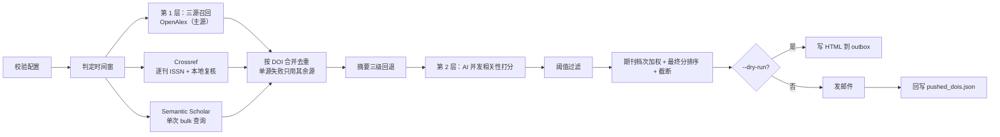

# 顶刊文献自动推送机器人

每周五晚自动检索 15 本材料/能源/化学顶刊的最新论文，用 AI 判断是否与**你配置的研究方向**
相关，只把真正相关的文献整理成中文周报邮件发到你的邮箱。

> 🚀 **第一次用？** 直接看 [部署到 GitHub（完整流程）](#部署到-github完整流程)
> —— 从装 Git 到收到第一封邮件，6 步走完，全程约 20 分钟。

> **换课题只需改 `src/config.py` 里的一段配置**（`RESEARCH_TOPICS`，或单方向时的
> `RESEARCH_FIELD` / `RESEARCH_DESCRIPTION` / `USER_KEYWORDS` / `TOPIC_QUERY`），代码不用动。
> 详见 [如何换研究方向](#如何换研究方向)。

> **当前已开启多主题**：同时跟了两个方向 —— 「富锂锰正极」+「钠离子正极」，
> **每个主题各检索、各打分、各发一封邮件、各记各的已推送记录**。
> 详见 [多主题调研](#多主题调研)。

筛选分**两层**，各司其职：

| 层级 | 手段 | 作用 | 实测候选量 |
|---|---|---|---|
| 第 1 层 | **多源字面短词召回**（OpenAlex + Crossref + Semantic Scholar，三源各自查完后按 DOI 合并） | 按研究方向捞出**可能相关**的全部论文 | 首次 90 天窗下两个主题各约 70～110 篇；常规 14 天窗约 20～60 篇 |
| 第 2 层 | AI 逐篇打分（0–100），低于阈值丢弃 | 按**你的具体兴趣**做精读判断 | ~20 篇入选（首次预热 50 篇） |

> 第 1 层也可以用 OpenAlex 的**语义主题** `topics.id`（`--retrieval-mode topic`），
> 但实测它的粒度太粗：细分方向（`sodium-ion battery`、`lithium-rich`）在 OpenAlex 里
> **根本不存在对应主题**，解析结果直接是 0 条。所以默认走字面短词。

> AI **不负责关键词匹配**。它拿到的是第 1 层已经筛过的候选集，再做一轮语义相关性打分。

入选后的**排序**叠两层加成：`最终分 = AI 相关性分 + 期刊档次加成 + 内容规则加成`

- **期刊档次加成**：正刊 +12 > 大子刊 +9 > Joule +7 > 小子刊 +5 > JACS +4 > Angew +3 > AM +2 > 其他 +0
- **内容规则加成**（按关键词命中，只看标题+摘要）：固态电池 +1 ｜ 固态聚合物电解质 +1 ｜
  无负极 **+10** ｜ 层状钠离子正极 +2（仅「钠离子正极」主题）

> 两种加成**只管排序，不管入选** —— 是否进邮件依旧只看 AI 分数是否过 `AI_THRESHOLD`。
> 详见 [内容规则](#内容加权bonus_rules--exclude_rules)。

还有一条**硬保底**（`KEEP_RULES`）：命中即**强制进邮件**，
**免于所有剔除规则、也免于 AI 入选线**，并排到最前。

- 当前保底方向：**无负极（含锂/钠）**，但**必须同时是富锂锰或钠电体系** ——
  即便是电解液工程也要留着，因为「电解液工程」本来是硬剔除项，
  一篇无负极钠电电解液论文会连 AI 都没见过就被丢掉。
- 这条路上有**两道入口**（都要体系对口）：
  1. **词表**：标题/摘要命中「无负极」写法 **且** 命中富锂锰/钠电体系词（`require` 闸门）；
  2. **AI**：无负极往往是**电芯构型**而非研究重点，标题里可能一个字都没写 ——
     所以让 AI 顺手从摘要描述的电芯结构判一次（返回 `anode_free` + `cathode_system`），
     判定为「无负极 + 富锂锰/钠电」时**同样按保底处理**。
  加体系闸门的原因很具体：只写「无负极」会把锂硫之类完全无关的论文也置顶（真实事故，见下文）。
- 卡片上会打绿色标签 `🎯 硬保底 · 无负极` 解释它为什么排在前面
  （AI 判定那条会写 `🎯 硬保底 · 无负极（AI 判定 · 钠电）`）。

- 检索：**三个免费数据源并集** —— OpenAlex（主）+ Crossref + Semantic Scholar（备用）。
  三源各查一遍再按 DOI 合并；**任一源挂掉不影响其余源**，并在邮件页头显式提示。
  详见 [数据源](#数据源)
- 筛选：任意 **OpenAI 兼容** 的 AI 接口（默认 DeepSeek `deepseek-chat`）
- 邮件：SMTP（QQ / Gmail / 163 / Outlook…）
- 调度：**GitHub Actions**（仓库自带 workflow，无需服务器）

---

## 目录结构

```
.
├── .github/workflows/weekly_push.yml   # 定时任务（每周五 23:07 北京时间）
├── src/
│   ├── config.py                       # ★所有"可能要改"的参数（研究方向、期刊、阈值、数据源）
│   ├── logger.py                       # 日志初始化（时区正确、幂等）
│   ├── sources/                        # ★多数据源层（三源并集）
│   │   ├── __init__.py                 #   调度：全查 → 合并 → 去重 → 单源失败不影响其余
│   │   ├── base.py                     #   work 统一结构、DOI 归一、本地字面复核、源名注册表
│   │   ├── openalex.py                 #   主源适配器
│   │   ├── crossref.py                 #   Crossref 适配器（按 ISSN 逐刊查 + 本地复核）
│   │   └── semantic_scholar.py         #   Semantic Scholar 适配器（单次 bulk 查询 + 自带限流）
│   ├── openalex_client.py              # 第 1 层召回：拼查询 + 分页 + 解析 + 主题解析
│   ├── abstract_source.py              # 摘要三级回退：OpenAlex → Crossref → S2
│   ├── ai_matcher.py                   # 第 2 层：AI 并发打分 + 稳健 JSON 解析
│   ├── content_rules.py                # 内容加分 / 剔除规则 / 硬保底（固态、无负极、层状钠…）
│   ├── ranking.py                      # 期刊档次 + 内容加分 → 最终分排序
│   ├── authors.py                      # 「一作 + 一通讯」显示名（只有 OpenAlex 给通讯作者）
│   ├── pdf_report.py                   # 超出正文上限的文献 → 手写 PDF 附件（无第三方依赖）
│   ├── dedup.py                        # DOI 去重 + 运行状态持久化（按主题分区）
│   ├── mailer.py                       # HTML 渲染 + SMTP 发送（含 PDF 附件）
│   └── main.py                         # 主流程编排（多主题循环）+ 命令行
├── tests/test_core.py                  # 341 个单元测试（锁定高风险修复）
├── data/
│   ├── pushed_dois.json                # 去重状态（唯一需要提交的文件）
│   ├── topics_cache.json               # 语义主题解析缓存（已 gitignore，自动重建）
│   ├── logs/                           # 运行日志（已 gitignore，Actions 里传 artifact）
│   └── outbox/                         # --dry-run 生成的 HTML 预览（已 gitignore）
├── push.ps1                            # ★本地改动一键同步到 GitHub（见「如何修改」）
├── push.cmd                            # 双击运行 push.ps1 的包装（免执行策略限制）
├── requirements.txt
└── README.md
```

---

## 部署到 GitHub（完整流程）

> 目标：代码躺在 GitHub 上，GitHub Actions 每周五 23:07（北京时间）自动跑一次并把邮件发出去。
> **全程只做一次，之后不用管。**

### 第 0 步：装 Git

先确认本机有没有：

```powershell
git --version
```

如果报「无法将"git"项识别为 cmdlet…」，有**两种**可能，先别急着重装：

**① 装过 Git，但终端没读到 PATH**（更常见）

安装到**非默认目录**（例如 `E:\Git`）时尤其容易这样。先查注册表确认：

```powershell
Get-ItemProperty "HKLM:\SOFTWARE\Microsoft\Windows\CurrentVersion\Uninstall\*",
  "HKLM:\SOFTWARE\WOW6432Node\Microsoft\Windows\CurrentVersion\Uninstall\*",
  "HKCU:\SOFTWARE\Microsoft\Windows\CurrentVersion\Uninstall\*" -ErrorAction SilentlyContinue |
  Where-Object { $_.DisplayName -like "*Git*" } | Select-Object DisplayName, InstallLocation
```

有输出（例如 `InstallLocation : E:\Git\`）就说明已经装了。两种办法：
**重开终端**（最干净），或在本会话里临时加进 PATH：

```powershell
$env:Path = "E:\Git\cmd;" + $env:Path   # 把路径换成上面查到的 InstallLocation
git --version
```

**② 确实还没装** —— 二选一：

| 方案 | 下载 | 说明 |
|---|---|---|
| **Git for Windows**（推荐） | <https://git-scm.com/download/win> | 一路「下一步」即可。会自带 Git Credential Manager，**首次 push 弹浏览器登录，不用手动建 Token** |
| **GitHub Desktop** | <https://desktop.github.com> | 图形界面，适合完全不想碰命令行的人 |

装完**重开终端**（PATH 才会刷新），再验证一次 `git --version`。

> **别忘了配邮箱**：`git config --global user.email "you@example.com"`。
> 只配了 `user.name` 的话 `git commit` 会直接报错。
> 不想暴露真实邮箱可用 GitHub 的 noreply 地址：`<用户名>@users.noreply.github.com`。

### 第 1 步：先本地跑通预览

推上 GitHub 之前，先在本地确认代码能跑。这一步不需要任何 Secret：

```bash
python -m pip install -r requirements.txt
python -m src.main --dry-run --no-ai --verbose
```

执行完打开 `data/outbox/<日期>.html` 就能看到邮件长什么样。
`--dry-run` **完全无副作用**：不发邮件、不改 `data/pushed_dois.json`。

> 只有这一步跑通了再往下走。否则推到 GitHub 后报错，你还得在 Actions 日志里排查，
> 比本地难看得多。

### 第 2 步：在 GitHub 建一个空仓库

1. 打开 <https://github.com/new>
2. **Repository name** 填一个名字，例如 `weekly-literature-push`
3. **Public / Private 都行**，区别见下表
4. ⚠️ **不要**勾选 "Add a README file" / ".gitignore" / "license"
   —— 本地已经有这些文件了，勾了会导致 push 冲突，还得手动 merge
5. 点 **Create repository**

| | Public | Private |
|---|---|---|
| Actions 免费额度 | 无限 | 2000 分钟/月（本任务每周约 1–2 分钟，够用） |
| 60 天无活动 | 定时任务被自动暂停 | **不会**被暂停 |

> 本仓库不含任何密钥（全部走 Secrets），所以 Public 也是安全的。
> 若你更在意隐私就用 Private，配额绰绰有余。

### 第 3 步：把本地代码推上去

在项目根目录（`e:\学习\研一上学期\文献自动推送`）开一个终端：

```bash
git init -b main
git add .
git status
git commit -m "feat: 顶刊文献自动推送机器人"
git remote add origin https://github.com/<你的用户名>/weekly-literature-push.git
git push -u origin main
```

> **★ 为什么必须先看一眼 `git status`**
>
> `.gitignore` 已经把 `.venv/`（几百 MB）、`data/logs/`、`data/outbox/`、
> `data/topics_cache.json`、`.vscode/`、`.env` 全部排除掉了。
> 但你要**亲自确认**列表里没有它们。
>
> 一旦把 `.venv/` 推上去，仓库会瞬间膨胀几百 MB；
> 一旦把 `.env` 推上去，密钥就泄露了 —— **而且即使删掉文件，它依然留在 git 历史里**，
> 只能靠重写历史或删库重建来补救。
>
> 正常应该只看到这些（约 15 个文件）：
> `.github/workflows/weekly_push.yml`、`.gitignore`、`README.md`、`requirements.txt`、
> `requests.md`、`src/*.py`、`tests/test_core.py`、`data/pushed_dois.json`

首次 `git push` 会要求认证：

- **装了 Git Credential Manager**（Git for Windows 自带）→ 弹出浏览器 → 点授权即可
- **没有** → 用 Personal Access Token 当密码：
  GitHub → Settings → Developer settings → Personal access tokens → Fine-grained tokens
  → 勾 `Contents: Read and write` → 生成后复制，粘贴到密码框

> ⚠️ **默认分支必须是 `main`**。GitHub Actions 的定时任务**只在默认分支上生效**，
> 而且要求 workflow 文件已经存在于默认分支。
> 所以别推到一个叫 `master` 的分支然后指望定时任务会跑。
> （如果你已经推错了：仓库 Settings → Branches → 把默认分支改成 `master`，
> 或者本地 `git branch -m master main` 后重新 push。）

### 第 4 步：配置 Secrets

打开仓库页 **Settings → Secrets and variables → Actions → New repository secret**，
依次添加下面 10 个必填 / 建议填的（本地调试时可改成环境变量）：

| Secret | 必填 | 说明 | 示例 |
|---|---|---|---|
| `OPENALEX_MAILTO` | 建议 | 你的邮箱，OpenAlex 会把你放进**礼貌池**（更快、更稳）。留空则复用 `SMTP_USER` | `you@example.com` |
| `OPENALEX_API_KEY` | 可选 | 只有碰到「当日额度用完（429）」才需要。在 openalex.org 免费注册后可拿到；不填也完全能跑 | `xxxxxxxx` |
| `CROSSREF_MAILTO` | 可选 | Crossref 礼貌池邮箱（填了请求更快更稳）。不填则用仓库默认邮箱 | `you@example.com` |
| `AI_BASE_URL` | ✅ | OpenAI 兼容端点 | `https://api.deepseek.com/v1` |
| `AI_API_KEY` | ✅ | AI 平台的 API Key | `sk-xxxxxxxx` |
| `AI_MODEL` | ✅ | 模型名 | `deepseek-chat` |
| `SMTP_HOST` | ✅ | 发信服务器 | `smtp.qq.com` |
| `SMTP_PORT` | ✅ | 端口（465 走 SSL，587/25 走 STARTTLS，脚本自动选择） | `465` |
| `SMTP_USER` | ✅ | 发信邮箱账号 | `you@qq.com` |
| `SMTP_PASS` | ✅ | **授权码 / App Password**，不是登录密码！ | `abcdefghijklmnop` |
| `MAIL_TO` | ✅ | 收件人，多个用逗号或分号分隔 | `a@x.com;b@y.com` |

> **关于 `SMTP_PASS`**：QQ/163 邮箱在「设置 → 账户 → POP3/SMTP服务」开启后生成**授权码**；
> Gmail 需要开启两步验证后生成 **App Password**。填登录密码一定会认证失败。

### 第 5 步：手动触发一次验证

代码推上去、Secrets 填好之后：

1. 打开仓库页的 **Actions** 标签
2. 左侧列表点 `weekly-literature-push`
3. 右上角 **Run workflow** → 把 `dry_run` 勾上 → 点绿色的 Run
4. 等 1–2 分钟跑完，进这次 run 的页面，拉到底部 **Artifacts** 下载
   `email-preview-*`，解压打开 HTML 检查效果（这一步不会发信）

确认 HTML 没问题后，再跑一次**不勾** `dry_run` 的：

- 这次会真的发邮件到 `MAIL_TO`
- 并把 `data/pushed_dois.json` 自动提交回仓库（commit 信息类似
  `chore: update pushed DOIs 2026-09-16`）

> **看不到 `Run workflow` 按钮？** 说明 workflow 文件不在默认分支上
> —— 回第 3 步确认你推的是哪个分支。
> 私有仓库还需确认 **Settings → Actions → General** 里没有禁用 Actions。

### 第 6 步：定时任务

**不用做任何事**，它已经配好了：

```yaml
on:
  schedule:
    - cron: "7 23 * * 5"        # 每周五 23:07
      timezone: "Asia/Shanghai" # GitHub 原生支持 IANA 时区，自动处理 UTC 换算
```

`timezone` 是 GitHub 官方支持的字段（[官方文档](https://docs.github.com/en/actions/reference/workflows-and-actions/events-that-trigger-workflows#schedule)），
**不需要自己换算成 UTC**。（等价的手工 UTC 写法是 `cron: "7 15 * * 5"`。）

> **为什么是 23:07 而不是 23:00？** GitHub 官方文档明确说明 `schedule` 事件
> 在 Actions 负载高峰时会被延迟，而「高峰期包括每个整点」——
> 安排在非整点能显著降低延迟。想改回整点就把 cron 写成 `"0 23 * * 5"`。

---

### 部署踩坑合集

| 现象 | 原因 / 解决 |
|---|---|
| 定时任务根本不跑 | ① workflow 文件不在默认分支；② 公开仓库 60 天无活动被暂停 → 去 Actions 页点 **Enable workflow** |
| 没有 `Run workflow` 按钮 | workflow 不在默认分支，或私有仓库禁用了 Actions |
| 报 `Missing required env` | Secret 名字拼错。**必须全大写、下划线**，如 `AI_API_KEY`。改名后要重新触发一次 |
| 邮件认证失败 | `SMTP_PASS` 填成了邮箱登录密码。QQ/163 要**授权码**，Gmail 要 **App Password** |
| 发信时间不对 | 检查仓库默认分支是不是 `main`、`timezone:` 那行还在不在。注意定时时间是 **23:07**（`cron: "7 23 * * 5"`，每周五），不是整点 |
| Actions 显示绿色但没收到邮件 | 看日志末行的「运行摘要：候选 N → 去重后 M → 入选 K」。K=0 时也会发心跳邮件；若连心跳邮件都没有，检查 `MAIL_TO` 和垃圾邮件箱 |
| `git push` 报 `src refspec main does not match any` | 本地还没 `git commit`，或者本地分支不叫 `main` |
| push 被拒绝 `rejected (fetch first)` | ① 建仓库时勾了 "Add a README file"；② **机器人自动提交了 `data/pushed_dois.json`**（最常见）。别手动折腾，直接双击 `push.cmd`，它会自动 fetch + rebase + 重试推送 |
| 每周都跑但状态文件没更新 | 正常。`data/pushed_dois.json` 无变化时脚本会主动跳过 commit |
| `push.cmd` 一直提示连不上，最后报 `Failed to connect to github.com:443` | **不是你的 git 配错了，是网络**。国内 `github.com` 常常时通时不通（典型表现：`api.github.com` 能访问、`github.com` 超时 21 秒）。挂上代理后让 git 也走代理：`git config --global http.proxy http://127.0.0.1:7890`（端口换成你代理软件的）。取消：`git config --global --unset http.proxy` |
| 黄色警告 `Node.js 20 is deprecated` | **任务仍然会成功，但要修**。三个官方 action 的旧大版本内部声明的是 Node 20，而 Node 20 已于 **2026-09-23 从 runner 上彻底移除**。本项目已升级到 `checkout@v7` / `setup-python@v7` / `upload-artifact@v7`（内部为 `node24`）。以后凡是「绿色 ✔ + 黄条警告」，八成都是这类依赖过时，去对应 action 的 releases 页取最新大版本号即可 |
| **改了 `keywords`，候选量一点没变** | **不是 bug**：`keywords` 是给 AI 的打分尺，召回去看 `search_terms`（见 [两把旋钮](#two-knobs)）。拿不准就跑 `python -m src.main --show-config` |
| **两个主题的候选数一模一样 / 都不像自己方向 / 少到发慌** | 这是曾经真实发生过的事故：主题短语解析为 0 时旧版本会**静默丢掉主题条件**，退化成「全部期刊近 30 天」全库检索，两个主题拿到同一批无关论文。现已改成**直接报错**（`RuntimeError` + 退出码非 0 + Actions 变红）。看到红色 ≠ 坏了，而是它在告诉你“召回条件没生效” |
| 报 `OpenAlex 今日额度已用完（HTTP 429）` | 2026 年起 OpenAlex 按请求计费（匿名 1000 积分/天）。当天调试次数太多就会耗尽，**要等次日 UTC 零点**，重试无用。**但因为现在有三源并集，这已经不会让周报断更**：本轮先用备用源 `--sources crossref,s2` 应一下，或直接等定时任务自己跑（Actions 走另一套出口 IP）；彻底解决：配 `OPENALEX_API_KEY` |

> **想让定时任务更准时**：GitHub 官方文档明确说明**整点（minute = 0）是负载高峰**，
> 任务可能被延迟几分钟甚至几十分钟，所以本项目已经把 cron 设成了非整点的
> `"7 23 * * 5"`（每周五 23:07 北京时间）。

---

## 命令行参数

```bash
python -m src.main [选项]
```

| 选项 | 作用 |
|---|---|
| `--dry-run` | 只把邮件 HTML 写到 `data/outbox/`，不发信、不写状态 |
| `--retrieval-mode X` | 第 1 层召回方式：`keyword`（**默认**，主题 `search_terms` 字面短词，粒度准）/ `topic`（OpenAlex 语义主题，粒度粗）/ `both`（并集） |
| `--sources LIST` | 本轮启用哪些数据源，逗号分隔（默认 `config.DATA_SOURCES` = 三个全开）。例：`--sources openalex` 只跑主源（请求最少）；`--sources crossref,s2` 只用备用源（排查主源时用）。简写 `oa` / `cr` / `s2` 均可 |
| `--force-first-run` | 强制按首次运行处理（用 90 天预热窗） |
| `--lookback-days N` | 临时覆盖时间窗天数，如 `--lookback-days 90` 回补三个月 |
| `--max-items N` | 单封邮件最多展示篇数（默认：首次 50、之后 20）；超出的部分进 PDF 附件 |
| `--no-attachment` | 本轮不生成 PDF 附件（退回旧行为：超上限的只显示「另有 N 篇未在此展示」） |
| `--max-fetch N` | 最多拉取候选文献数（默认 300） |
| `--topic NAME` | 只跑指定主题（可重复，如 `--topic 富锂锰正极 --topic 钠离子正极`），匹配主题的 `name` 或 `key`；省略则跑全部 |
| `--threshold N` | AI 相关性阈值，低于此值不展示（默认 60） |
| `--keywords "a;b"` | 临时覆盖研究方向（`keyword` 模式下会**作为召回条件**；`topic` 模式下只当 **AI 打分标准**，不参与检索） |
| `--show-config` | 只打印「靠什么召回 / 靠什么打分」然后退出，**纯离线、不联网、不跑主流程**。改完配置拿不准改动落在哪一层时先跑它 |
| `--find-topic [QUERY]` | 只查询 OpenAlex 语义主题、打印候选 id/名称，**不跑主流程**（省略 QUERY 则用 `config.TOPIC_QUERY`） |
| `--to addr` | 临时覆盖收件人（多个用逗号分隔） |
| `--no-ai` | 跳过 AI 打分，全部展示（仅用于排查检索/邮件链路） |
| `--verbose`, `-v` | 控制台输出 DEBUG 级日志 |

常用组合：

```bash
# 改完 config.py 先跑这个：离线看「靠什么召回/靠什么打分」，秒出
python -m src.main --show-config
python -m src.main --show-config --retrieval-mode both   # 预览切到 both 之后的样子

# 完整链路预览（需要 AI_API_KEY，不需要 SMTP）
python -m src.main --dry-run --verbose

# 回补最近 90 天，最多 50 篇
python -m src.main --dry-run --lookback-days 90 --max-items 50

# 只验证检索和邮件是否通
python -m src.main --no-ai --to me@example.com --dry-run

# 对比语义主题检索（召回量随方向变化，细分方向往往是 0）
python -m src.main --dry-run --no-ai --retrieval-mode topic

# 两种检索取并集（召回最高）
python -m src.main --dry-run --retrieval-mode both

# 查看当前研究方向会解析成哪个语义主题
python -m src.main --find-topic

# 试一个全新的研究方向（找候选主题 id）
python -m src.main --find-topic "perovskite solar cell"

# 多主题时只跑其中一个方向（名字或 key 都行，可重复）
python -m src.main --dry-run --topic 富锂锰正极

# OpenAlex 额度用光 / 疑似被限流时，先用备用源把这一轮跑出来
python -m src.main --dry-run --sources crossref,s2

# 只跑主源（请求最少、最快）
python -m src.main --show-config --sources openalex
```

---

## 运行逻辑

### 时间窗：首次预热 + 之后滚动

| 场景 | 时间窗 | 目的 |
|---|---|---|
| **首次运行**（`pushed_dois.json` 为空） | 最近 **90 天** | 一次性把积压的文献补齐，避免刚部署时收到空邮件 |
| **之后每次** | 最近 **14 天** | 每周跑一次，14 天重叠期能兜住节假日跳过、接口抖动等漏网 |

> ⚠️ 首次窗口特意开到 90 天，是因为 **OpenAlex 对新论文的收录有滞后**：
> 论文可能月初就在线了，进 OpenAlex 却晚几周，而 `from_publication_date` 卡的是收录到的发表日。
> 窗口开窄（早期默认 30 天）时，刚部署那阵子会出现「我手动翻期刊网站明明有好几篇，
> 机器人却说没有」的假象。
>
> 首次跑完就会把推过的 DOI 写进 `pushed_dois.json`，之后每轮只按 14 天滚动，不会重复推送。

可用 `--force-first-run` 或 `--lookback-days N` 临时改变。

### 主流程



> 多主题时上面这段链路**每个主题各跑一遍**（各自去重、各自排序、各自一封邮件），
> 任一主题失败不影响其余主题，但最终仍会让 Actions 变红，避免静默漏推。

> **第 1 层与第 2 层的职责必须分清**：第 1 层只管「尽可能别漏」，第 2 层只管「判得准」。
> 因此第 1 层宁可用宽一点的短词并联（多推几十篇给 AI 看的成本极低），
> 也绝不能出现「明明有配置却什么都没搜」的情况。

**关键安全约定：只有邮件发送成功才回写状态。** 否则一旦 SMTP 挂了，
文献会被标记成"已推送"而永久丢失。

### 数据源（第 1 层到底“问谁要”）

<a id="数据源" name="数据源"></a>

**问题**：只有一个数据源时，“这个源今天状态不好”就等于“这周没有文献”。
OpenAlex 2026 年起按额度计费（匿名 1000 积分/天），调试期间很容易打光；
更坑的是它是**静默**变差 —— 返回 429 而不是空列表，旧版本会把它当成“没搜到”。

**做法**：`config.DATA_SOURCES` 里配的源，**每轮全部查一遍，再按 DOI 合并**。

```python
DATA_SOURCES = ("openalex", "crossref", "semantic_scholar")   # 顺序即优先级
```

> 这里**故意不做自动降级**（主源失败才用备用源）。自动降级有个隐蔽毛病：
> 主源“部分成功”（只返回 3 篇而不是 300 篇）时它不会触发，你以为跑得好好的，
> 其实已经漏了一周。全查 + 合并没有这个盲区，代价只是多几次 HTTP 请求（都免费）。

#### 三个源各自的特点（实测）

| | OpenAlex（主） | Crossref | Semantic Scholar |
|---|---|---|---|
| 覆盖 | 最全 | 全，但 **RSC 的 EES 一条都没有** | 偏 CS/生物，材料类命中少 |
| 期刊定位 | ISSN 精确过滤 | 按 ISSN 逐刊查 | **期刊名/ISSN 常年错**，只能按 DOI 前缀认 |
| 摘要覆盖率 | 高 | Wiley ≈100%、ACS ≈88%、**Joule 0%、Nature Energy 8%** | 中（约 80%） |
| 查询语法 | `title_and_abstract.search` 短语级 | `query.title` 是**分词**的，不是短语 | OR 必须用竖线 `\|` 分隔，空格 = AND |
| 限流 | 有日额度，会 429 | 走 polite pool（填 `mailto`） | ~1 请求/秒，需自己节流 |
| 关键词模式 | keyword / topic / both | 只支持字面关键词 | 只支持字面关键词 |

三条由此推出的硬性约定：

1. **Crossref 的结果必须本地复核。** 实测 `query.title=lithium-rich` 返回的
   前 71 篇全是锂金属/电解液论文（`li-rich` 被拆成了 `li` + `rich`）。
   程序会用主题的 `search_terms` 在本地的“标题+摘要”里再匹配一遍**整词**，
   不匹配的直接丢掉，并记进日志。
   ⚠️ **但有两本刊要特殊对待**：实测 *Joule* 近半年 100 篇里 **0 篇**带 abstract，
   *Nature Energy* 只有 8 篇（而 *Advanced Materials* 有 91 篇）。这几本刊里
   复核退化成“只看标题”，会把标题不含字面词但确实是本主题的论文误杀。
   所以 `config.CROSSREF_TITLE_ONLY_JOURNALS` 里的刊**在记录没有摘要时不做复核**，
   直接交给 AI 阈值兜底，放宽条数会写成一条 INFO 日志 —— 不做静默降级。
2. **Semantic Scholar 的期刊名不可信，一律按 DOI 前缀判定。**
   实测一篇货真价实的 *Advanced Materials* 论文（`10.1002/adma.74958`）
   被它写成 `venue = "Advances in Materials"`、`issn = "2327-2503"`；
   *Angewandte* 干脆没有期刊字段。所以 `config.JOURNAL_DOI_PATTERNS`
   才是唯一可信依据（`10.1002/adma.` → Advanced Materials），
   期刊名只作兜底（`config.S2_VENUE_ALIASES`）。
   遇到认不出来的期刊名会**记 WARNING 并列出名字**，不会静默丢掉。
3. **`Energy & Environmental Science` 目前只有 OpenAlex 能召回。**
   RSC 的 DOI 形如 `10.1039/D6EE01234A`，既没有可判别的 DOI 前缀，
   Crossref 里也**查不到任何一条它的记录**（实测 `issn:1754-5706` → `total = 0`）。
   只跑备用源时，“EES 0 篇”是**正常现象**，日志里会专门写一句提醒。

#### 出错时的行为（四种，都不会静默）

| 情况 | 行为 |
|---|---|
| 某一个源失败（429 / 超时 / HTTP 500） | 其余源照常合并发信；邮件**页头**出现 `⚠️ 本轮有数据源不可用（OpenAlex），结果由其余数据源合并而来，可能比平时少。`；日志里记具体原因 |
| **源成功、但某几本刊查询失败**（Crossref 逐刊查询） | 源状态仍是 `ok`，但页头会写成 `Crossref 27 篇⚠️有 1/15 本刊查询失败（Angewandte Chemie Int. Ed.）…`，另外附一条 `⚠️` 提示。**“少了一整本顶刊”必须看得见** |
| 源只支持关键词、但本轮是 `topic` 模式 | 该源标为“未参与”并说明原因，不算失败 |
| **所有**源都失败 | 直接 `RuntimeError` 中断该主题（Actions 变红），不发明知道不完整的邮件 |

> **为什么 Crossref 并发只有 3 而且带重试**：实测 5 并发会触发 429，而 Crossref 是按刊
> 并发请求的 —— 一次 429 就等于**整本刊从本轮结果里消失**：同一条命令连跑两次
> 得到“命中 39 条”和“命中 27 条”，而日志里只有一行 WARNING，邮件页头照旧写
> “Crossref 27 篇”，完全看不出少了哪本刊。现在 3 并发 + 对 429/5xx 退避重试
> （`CROSSREF_RETRIES` / `CROSSREF_RETRY_WAIT`），并且**单刊失败会写进邮件页头**。
> 404 之类的 4xx 不重试 —— 白等只会拖慢整轮。

> 页头提示不是装饰。**日志在手机上没人看，页头才看得见** ——
> “这周只有 4 篇”和“这周三个源都正常，就是没几篇”是两件完全不同的事，
> 必须让你一眼分清。

#### 怎么调整

```bash
python -m src.main --show-config                         # 看当前启用了哪些源
python -m src.main --show-config --sources crossref,s2   # 预览“只用备用源”的样子
python -m src.main --dry-run --sources crossref,s2       # 主源挂了时的应急跑法
```

要永久改：编辑 `config.py` 的 `DATA_SOURCES`（顺序即优先级，
合并同一条论文的元数据时以先到的为准）。**留空会直接报错**，
不允许出现“一个源都没有”的状态。

相关参数（都在 `config.py`）：

| 参数 | 默认 | 作用 |
|---|---|---|
| `DATA_SOURCES` | 三个全开 | 启用哪些源 |
| `MAX_EMAIL_ITEMS` / `MAX_EMAIL_ITEMS_FIRST_RUN` | 20 / 50 | 正文最多展示几篇，超出的进 PDF 附件 |
| `OVERFLOW_ATTACHMENT` / `ATTACH_PDF_MAX_ITEMS` | True / 200 | 是否生成超上限附件、附件最多装几篇 |
| `ATTACH_PDF_FONT` / `ATTACH_PDF_ENCODING` / `ATTACH_PDF_CID_ORDERING` | STSong-Light / UniGB-UCS2-H / GB1 | 附件用的中文字体（非嵌入预定义 CJK 字体，改错中文会变空） |
| `CROSSREF_ROWS` / `CROSSREF_CONCURRENCY` | 100 / **3** | 每刊拉多少条、并发几个刊（**别调高**，见上一段：5 并发会 429 丢整本刊） |
| `CROSSREF_RETRIES` / `CROSSREF_RETRY_WAIT` | 3 / 2.0 | 单刊请求失败的重试次数与基础等待秒数（只对 429/5xx 生效） |
| `CROSSREF_MAILTO` | 仓库邮箱 | Crossref polite pool，**建议改成你的邮箱** |
| `S2_BULK_LIMIT` / `S2_MIN_INTERVAL` | 1000 / 1.1 | S2 单次上限、最小请求间隔（秒） |

### 第 1 层：为什么默认用「字面短词」而不是「语义主题」

> 这一节的结论改过一次。最初（11 本刊 / 30 天 / 方向为「固态电池」）实测
> 语义主题召回 194 篇、字面关键词只有 36 篇，于是默认走了 `topics.id`。
> 换成更细的方向后**这个结论失效了**，原因见下面的实测表。

#### 为什么换方向后失效：OpenAlex 的主题粒度太粗

OpenAlex 的 `topics` 是它对每篇论文做的粗分类（几千个主题），**大方向有、细分方向没有**。
用 `/topics?search=` 逐个短语实测（2026-09）：

| 短语 | 解析到的主题 |
|---|---|
| `solid-state battery` | ✅ `T10281`（78980 篇） |
| `sodium-ion battery` | ❌ **0 条** |
| `sodium battery` | ⚠️ `T12875` Thermal Expansion（错了，不是钠电） |
| `lithium-rich` / `lithium-rich cathode` | ❌ **0 条** |
| `layered oxide` | ⚠️ `T10472` / `T13249`（与层状钠正极无关） |

也就是说「钠离子正极」「富锂锰正极」这类**你真正关心的细分方向，OpenAlex 根本没有对应主题**。

#### ★ 事故复盘：静默退化比报错危险得多

早期版本在 `topic_query` 解析为 0 条时，**只记一条 WARNING 就去掉了 `topics.id` 条件**，查询于是退化成
「14 本刊 × 30 天」的全库检索（实测 3772 篇），被 `MAX_WORKS_FETCH=300` 截断后，
**两个主题拿到的是同一批 300 篇无关论文**（去掉无 DOI 的剩 275 篇）。
AI 几乎全部拒绝 → 「富锂锰正极」0 篇、「钠离子正极」4 篇，
表面看像是「规则太严」「摘要没抓到」，实际是召回条件整个丢了。

> 两个独立分区的命中数**完全相同**（275 / 275），是「候选池没被区分开」的强信号。

现在改为**直接报错**：召回条件缺失时抛 `RuntimeError`，该主题本轮失败、进程退出码非 0、
Actions 变红。宁可贵主题失败，也不要「绿着跑错」。

#### 短词 OR 并联 vs 长短语：实测差距 18 倍

`search_terms` 是**逐字**在标题/摘要里匹配的，所以「越像论文里真会写的短词越好」。
以「富锂锰正极」为例，30 天 / 14 本刊实测（这是当时条件下的数据；配置后来变成了
90 天 / 15 本刊 / 三源，但下面「短词 ≫ 长短语」的结论完全不变）：

| 写法 | 召回 |
|---|---|
| 12 条学术长短语（含 `Li2MnO3`、`LRLO`、带括号/斜杠的写法） | **1 篇** |
| 7 条短词 OR 并联（`li-rich`、`oxygen redox`、`anionic redox`、`voltage decay`…） | **18 篇** |

单看每条词的贡献（篇 / 30 天）：`li-rich` 8、`oxygen redox` 7、`anionic redox` 5、
`voltage decay` 4、`lithium-rich` 2、`lithium rich` 2、`voltage hysteresis` 1；
而 `li2mno3` / `lrlo` / `lmr` 这类缩写实际是 **0**（论文里不这么写）。
「钠离子正极」同理：`sodium-ion` 34、`sodium ion` 34、`na-ion` 8、`prussian blue` 5。

两条经验：
1. **别用缩写、别带 `/` `(` `)`** —— OpenAlex 字面检索下命中数几乎必然为 0（`config.py` 会在
   `--show-config` 里直接警告你）。
2. **词组别超 4 个词** —— 越长越搜不到，用 OR 并联几个短词比写一条长的好得多。

字面召回的代价是「换表述的论文会漏」，而**漏是这套系统里最不能接受的失败**：
比「多推一篇无关的」严重得多（多推只是多看一眼，漏掉一篇要盯的方向可能几周都不知道）。
所以取值口径是**召回宁滥勿缺**，精度交给后面两层 —— AI 打分与保底闸门。

> ⚠️ **上表只讨论召回层（OpenAlex 字面检索）。** 同一批缩写词在**闸门 / 加分**那一层是另一回事：
> 那里是**本地正则**匹配标题+摘要，而摘要里常写 `LRLO cathodes`、`an over-lithiated (OLO) oxide`、
> `Li2MnO3-like domains` —— 所以 `li2mno3` / `lrlo` / `lmr` / `olo` 照样有用
> （见 [硬保底与体系闸门](#内容加权bonus_rules--exclude_rules)）。两层词表要的就是「召回捞得到的，闸门也认」。

```bash
python -m src.main --find-topic                  # 查 topic_query 解析成什么
python -m src.main --find-topic "perovskite"     # 查任意短语的候选主题
```

### ⚠️ 检索绝不能用 URL 参数 `search=`

OpenAlex 的 URL 参数 `search=` 等价于**全文检索**（OQL 解析为 `fulltext has (...)`），
会把"News & Views"、评论文章、甚至参考文献里顺带提到关键词的内容全捞进来。
关键词必须放进 `filter=`（`topic` 模式下则完全不需要关键词）。

`--retrieval-mode keyword`（**默认**）时生成的 `filter=` 形如：

```
filter=primary_location.source.issn:1476-4687|1095-9203|...,
       from_publication_date:2026-08-16,
       type:article,is_retracted:false,is_paratext:false,
       title_and_abstract.search:"li-rich" OR "oxygen redox" OR "anionic redox"
```

`--retrieval-mode topic` 时（把 `topics.id` 换进来）：

```
filter=primary_location.source.issn:1476-4687|1095-9203|...,
       from_publication_date:2026-08-16,
       type:article,is_retracted:false,is_paratext:false,
       topics.id:T10281
```

⚠️ 两种模式在**召回条件缺失时都会直接报错**（而不是把条件悄悄丢掉）：

| 模式 | 缺什么 | 行为 |
|---|---|---|
| `keyword` | `search_terms` 和 `keywords` 都是空 | `RuntimeError`，该主题本轮失败 |
| `topic` | `topic_query` 解析为 0 个主题 | `RuntimeError`，该主题本轮失败 |
| `both` | 只有一种缺失 | 记 WARNING，用剩下的那一种继续跑 |

### 第 2 层：AI 拿到候选集后做什么

AI 对每篇候选返回一个 **0–100 相关性分数** + 一句话中文结论 + 判断理由。
评分基准就是 `config.py` 里那份"研究方向"描述，**没有硬编码任何学科**：

| 分数段 | 含义 |
|---|---|
| 90–100 | 正面解决该方向的核心问题，读完可直接用于该方向的研究 |
| 70–89 | 属于同一材料体系或同一技术路线，只是研究角度不同 |
| 50–69 | 相邻领域，可能沾边但需人工判断，或只把该方向当作应用场景之一 |
| 0–49 | 明显不属于该方向，或属于综述/展望/纯工程应用类内容 |

低于 `AI_THRESHOLD`（默认 60）的不进邮件。摘要缺失时会把"仅有标题"这一事实
明确告知 AI，让它自己降低置信度，而不是让程序瞎猜。

> 提示词里也明确要求 AI **以标题+摘要实际写的内容为准，不要被期刊名影响**。

**另外还要两个结构化字段**（用来做「无负极」保底的第二道入口）：

```json
{ "relevance": 78, "takeaway": "…", "reason": "…",
  "anode_free": true, "cathode_system": "sodium" }
```

- `anode_free`：电芯里是不是**没有负极活性材料**（充电时直接沉积在裸集流体上）。
  无负极常常**不是论文的研究重点**（「电解液工程 + 裸 Cu 集流体」），标题里可能一个字都没写，
  所以口径里明确告诉 AI：**从摘要描述的电芯结构自己读出来**，不要只在标题里找关键词。
- `cathode_system`：只允许 `"li-rich-mn"`（富锂锰基）/ `"sodium"`（钠电）/ `"other"`。
- 解析是**宽容**的（`true` / `"true"` / `"是"` 都算真；`Li-rich-Mn` / `Li-rich` / `lrlo` /
  `LMR` / `OLO cathode` / `Na-ion` / `富锂锰` 都归到对应档位），但**认不出来就不保底** ——
  猜错等于凭空置顶一篇不相关的论文。
  （别名表很长，而且里面的键与查表用的键是在同一套归一化下生成的 ——
  以前手写键漏了归一化，导致 `Li-rich` / `Na-ion` 这类**多词别名全部静默失效**，见
  [闸门审计](#gate-audit)）
- 判定为「无负极 + 富锂锰/钠电」时该论文**视同命中硬保底**（免阈值 + 置顶），
  详见 [内容规则](#内容加权bonus_rules--exclude_rules)。

### 摘要三级回退（以及一个诚实的局限）

| 级别 | 来源 | 实测命中率 |
|---|---|---|
| 1 | OpenAlex `abstract_inverted_index` | ~96%（186/194） |
| 2 | Crossref `message.abstract`（JATS，会去标签） | 少量补充 |
| 3 | Semantic Scholar `abstract`（无鉴权约 1 req/s，已加节流 + 429 退避 + **熔断**） | 少量补充 |

第 2、3 级都带 **429 / 5xx 退避重试**（4xx 不重试）。为什么要重试：摘要是 AI 打分的
主要依据，碰上一次限流这篇文献就退化成「仅看标题」，代价远高于多等几秒。
实测 `Crossref 无摘要 … (HTTP 429)` 的诱因有两个，都已修：
① 逐刊检索刚发完 15 本刊×100 条，紧接着 4 个线程逐篇查摘要，把礼貌池短暂打满；
② 这一路原来用的是 `OPENALEX_MAILTO`（只来自 `SMTP_USER`，**本地为空** ⇒
不在礼貌池），现在统一用有内置默认值的 `CROSSREF_MAILTO`。

**已知局限**：最新的 Nature / Nature Energy / Joule 等论文，OpenAlex 的
`abstract_inverted_index` 常常是 `null`，而**此时 Crossref 和 Semantic Scholar 同样也没有摘要**
（实测：`10.1038/s41560-026-02133-3`、`10.1016/j.joule.2026.102680`、
`10.1038/s41563-026-02729-w` 三篇在新库里都没有摘要）。

这是**出版商索引延迟**导致的，任何第三方接口都无法绕过。此时程序会：
- 摘要填 `（摘要暂缺）` 交给 AI 猜相关性（置信度更低，会明确告知 AI）
- 邮件卡片上打一个 `依据：标题（摘要缺失）` 标签，提醒你这篇判断依据不足
- 摘要**只喂给 AI，从不出现在邮件正文里**（尊重版权 + 保证邮件体量可控）

AI 打分失败时卡片会打 `AI 打分失败` 标签，且该文献仍会展示，不会静默消失。

> **S2 熔断**：Semantic Scholar 公共池一旦开始限流，通常整段时间都在限流。
> 实测 8 篇文献逐篇重试要白等约 50 秒且一篇摘要都拿不到，因此加了进程级熔断
> （`S2_CIRCUIT_BREAK_AFTER`，默认连续 4 篇彻底失败后本轮不再请求 S2，
> 实测耗时 49s → 28s）。熔断只作用于当前进程，下次运行自动重试。
>
> Crossref 那一路也有自己的熔断（`CROSSREF_CIRCUIT_BREAK_AFTER`，默认 **8**）——
> 阈值故意比 S2 宽得多：这里的 429 往往是**自己上一波请求打出来的**，
> 退避一两秒就好，熔断反而是自损。它只用来封顶最坏情况耗时。两级各自独立，
> Crossref 熔断不会连累 S2（它只是降级链路的上游）。

---

## 邮件长什么样

每篇文献一个卡片，只包含：

```
┌──────────────────────────────────────────────────────┐
│ JACS · 2026-09-10                           最终 84 分   │
│ 🎯 硬保底 · 无负极  JACS +4（AI 70）  无负极 +10         │
│ 依据：标题 + 摘要                                     │
│ 无负极钠金属电池的电解液设计                          │
│ 作者：Wei Zhang（一作） · Yan Li（通讯）              │
│ ├ 一句话结论：用弱溶剂化电解液把无负极钠电库仑效率提到 99% │
│ └ 判断理由：无负极构型是重点关注方向，电解液工程也不例外  │
│ DOI: 10.1021/jacs.6c02133  ← 可点击                    │
└──────────────────────────────────────────────────────┘
```

- **作者行只写「一作 + 一通讯」两个名字**（`src/authors.py`）：同一人就合成一个
  `张三（一作兼通讯）`；只有一作时写 `张三（一作）`。通讯作者**只有 OpenAlex 提供**
  （`is_corresponding`），Crossref / Semantic Scholar 没有这个字段，这类文献就**只显一作**；
  共一（共同第一作者）三个源都没有，也不猜 —— 拿末位作者冒充通讯作者比不写更坑人。
- 单封最多 **首次 50 篇 / 之后 20 篇**（`config.MAX_EMAIL_ITEMS_FIRST_RUN` /
  `MAX_EMAIL_ITEMS`），候选多于上限时按**最终分降序**取舍，**超出部分不会丢**：
  会按同样格式排进一封 **PDF 附件**（`主题-日期-附件N篇.pdf`）跟你一起发出，
  邮件页头会写明「另有 N 篇相关文献超出正文上限（20 篇），已按最终分降序排进附件…」。
  这样既避开 Gmail 102KB 截断，又不用把高分文献拖到下周。首次预热窗宽 6 倍、候选也是
  同一量级，只来一次，所以单独放宽；主题行里的篇数与正文用**同一个上限**，
  不会出现“主题说 20 篇、正文 50 篇”的错觉（想手动改：`--max-items N`，始终优先）
- 附件的篇数上限是 `config.ATTACH_PDF_MAX_ITEMS`（默认 200 篇），装不下的**不会**被记为已推送，
  下轮会重新评估（邮件里会写出来）。总开关 `config.OVERFLOW_ATTACHMENT`，
  单轮关掉用 `--no-attachment`（关掉就退回旧行为：只显示「另有 N 篇未在此展示」）
- 排进附件 = 已经送到你手里，所以**附件里的文献也会被记为已推送**，下周不会重复推送；
  干跑不生成附件：`--dry-run` 会把 PDF 和 HTML 一起写进 `data/outbox/` 供你预览
- 有加成的论文：右上角显示 `最终 84 分`（而不是 `AI 70 分`），
  并多出浅色标签 `JACS +4（AI 70）`、`无负极 +10`，让你一眼看出它排在前面的原因
- 命中**硬保底**（`KEEP_RULES`）的论文多一个绿色标签 `🎯 硬保底 · 无负极`，
  并且**排在所有其它文献前面**；页头也会写 `其中 N 篇命中了保底规则…已置顶并强制保留`。
  不加这个标签的话，「AI 35 分排在 AI 78 分前面」看起来就像个 bug
- 被剔除规则（见下）丢掉的论文**不会进邮件**，但在页头会显示 `规则剔除 N 篇`，
  不至于让你以为漏了东西（命中硬保底的不算被剔除，即使它命中了剔除规则里的词）
- **0 篇结果时也会发一封"心跳邮件"**（主题为 `… · 本周无新文献`），让你知道任务还活着，而不是静默失败
- 所有插入到 HTML 的字段都经过转义（标题里的 `<script>` 不会被执行）
- 同时生成纯文本副本，兼容不显示 HTML 的客户端
- 邮件主题：多主题下**每个主题一封**，形如 `富锂锰正极顶刊周报 · 2026-09-16 · 8 篇`、
  `钠离子正极顶刊周报 · 2026-09-16 · 3 篇`（前缀由主题的 `title` 或 `<name>顶刊周报` 决定；
  单方向时用 `EMAIL_TITLE`，即 `固态电池顶刊周报 · …`）

---

## 如何修改

<a id="two-knobs" name="two-knobs"></a>

### ★ 动手前先搞清一件事：配置里有「两把旋钮」

这是最容易误解的地方。先看这张表，能省你半小时。

| | 旋钮 A：**召回** | 旋钮 B：**打分** |
|---|---|---|
| 决定什么 | **哪些论文能进候选池** | 进了池子的论文，**AI 给谁高分** |
| 对应变量 | **`search_terms`**（多主题：主题里的 `search_terms`；单方向：`USER_KEYWORDS`） + `RETRIEVAL_MODE` | `RESEARCH_FIELD` + `RESEARCH_DESCRIPTION` + `keywords` |
| 改了会怎样 | **候选量会变** | **候选量一点不变**，变的只是 AI 那把打分尺 |
| 怎么确认改对了 | 日志里的「OpenAlex 命中总数 N」 | 邮件里的 AI 分数 / 理由有没有变准 |

> ⚠️ **召回词和打分词是两套东西，别搞混**：`search_terms` 是给 OpenAlex 的
> （要求能在标题/摘要里**逐字**出现，所以必须短），`keywords` 是给 AI 的
> （不要求逐字命中，可以写得又细又长）。想把「电压衰减」这个兴趣变成召回词，
> 得在 `search_terms` 里加 `voltage decay`；写在 `keywords` 里只影响打分。

> ⚠️ **当前已经开启多主题**（`RESEARCH_TOPICS` 非空），所以上面表里的 5 个变量
> **全部不再生效**，每个主题改用自己字典里的 `search_terms` / `keywords` / `description`。
> 这张表依然要看，因为它说的「两把旋钮」在多主题下同样成立，只是旋钮换成了
> 「主题的 `search_terms`」和「主题的 `keywords`」。
>
> 想回到单方向模式：把 `RESEARCH_TOPICS` 改回 `[]`。

> ⚠️ **默认 `RETRIEVAL_MODE = "keyword"`，此时 `keywords` 不参与召回。**
> 真正的召回词是主题里的 **`search_terms`**（见下一节）。
> 所以「我改了 `keywords`，跑一遍候选量纹丝不动」是**正常现象，不是 bug** ——
> `keywords` 是给 AI 看的语义线索，不拿去检索。
>
> 拿不准自己的改动落在哪一层，跑这一条 —— **纯离线、秒出、不联网、不发邮件**：
>
> ```bash
> python -m src.main --show-config
> ```
>
> ```
> 【召回层】keyword（字面短词）—— search_terms 7 个词的 OR 并联：li-rich、lithium-rich、oxygen redox、…（keyword 模式下 keywords 不参与检索）
> 【打分层】AI 0-100 分、入选线 ≥ 60 —— 尺子 = 「富锂锰正极」 + 关注关键词 12 个 + 补充说明；排序 = 最终分（AI 分 + 期刊档次加成 + 内容加分）降序
> 【提示】keyword 模式下改 keywords 不会改变候选量，要改的是 search_terms。……（多主题模式：改 RESEARCH_TOPICS 里「富锂锰正极」的 search_terms / keywords）
> ```
>
> 这两组三行在**每个主题、每次正常运行**时也会打进日志开头，所以每周 Actions 的日志里都留着
> 当时生效的配置与提示，事后回溯不用猜。

### 改完怎么生效：一键同步到 GitHub

**改什么 = 改哪里**（全部在 `src/config.py` 里，改完不用动其它任何文件）：

| 想改什么 | 改哪个变量 | 属于 |
|---|---|---|
| **能搜到什么**（召回词） | **主题的 `search_terms`** | 旋钮 A |
| 召回策略（字面 / 主题 / 并集） | `RETRIEVAL_MODE` | 旋钮 A |
| 语义主题短语（仅 topic 模式用） | `topic_query`（单方向时是 `TOPIC_QUERY`） | 旋钮 A |
| **搜到的里面留下什么**（AI 的打分尺） | **`USER_KEYWORDS`** + `RESEARCH_DESCRIPTION` | 旋钮 B |
| 方向名（邮件标题也用它） | `RESEARCH_FIELD` | 旋钮 B |
| **同时跑几个方向** | **`RESEARCH_TOPICS`** | — |
| **期刊** | **`JOURNALS`** | — |
| **期刊权重**（顶刊加多少分） | **`JOURNAL_TIERS`** | — |
| **内容加分 / 不看什么** | **`BONUS_RULES`** / **`EXCLUDE_RULES`**（或主题的 `bonuses` / `exclude`） | — |
| **无论如何都要留的**（硬保底） | **`KEEP_RULES`**（或主题的 `keep`） | — |
| 评分阈值 / 并发 / 时间窗 | `AI_THRESHOLD` / `AI_MAX_WORKERS` / `LOOKBACK_DAYS` | — |
| 密钥、AI 供应商、收件人 | **GitHub Secrets**，改完即生效，**不用改代码也不用 push** | — |

**推荐流程**（三步）：

```bash
# ① 本地改 src/config.py，先确认改动落在哪一层（离线，秒出）
python -m src.main --show-config

# ② 再看真实检索结果对不对，别白等一周
python -m src.main --show-config                       # 先看召回词有没有写错（离线）
python -m src.main --dry-run --no-ai --verbose          # 看日志里的「OpenAlex 命中总数」
python -m src.main --find-topic "solid-state battery"   # 只有 topic 模式下才需要查主题

# ③ 同步到 GitHub
.\push.cmd                                # 或者在资源管理器里双击 push.cmd
```

`push.cmd`（实际逻辑在 `push.ps1`）会依次做 5 件事：

1. 检查待提交文件，**拦住 `.env` 等敏感文件**（推上去就泄露了，而且删掉也仍留在 git 历史里）
2. 跑全部单元测试（当前 341 个），**不通过就中止**（配置改错了根本推不上去）
3. `fetch` + `rebase` ← **关键，见下方说明**
4. `push`，失败自动重试 4 次（`github.com` 在国内时通时不通）
5. 校验远程 commit 和本地是否一致

> **★ 为什么第 3 步「rebase」不能省**
>
> 每次真实发信后，GitHub 上的机器人会**自动提交一次** `data/pushed_dois.json`
> （记录已推送的 DOI，按主题分区，防止下周重复推送给你）。
> 也就是说**远程永远会比你本地多一个提交**。
> 如果你直接 `git push`，会被拒绝并报：
>
> ```
> ! [rejected]        main -> main (fetch first)
> error: failed to push some refs to 'https://github.com/...'
> ```
>
> 这**不是你把什么东西弄坏了**，只是需要先同步。`push.cmd` 已经帮你处理好。
> 手动操作的话就是先 `git pull --rebase origin main`，再 `git push origin main`。

> **另一种改法：直接在 GitHub 网页上改**
>
> 在仓库里点开 `src/config.py` → 右上角铅笔图标 → 改 → 底部 **Commit changes**。
> **不用装 Git、不用碰命令行、改完立刻生效**，适合只调一两行的情况。
>
> 代价是本地文件会变旧：下次从本地 push 之前，必须先
> `git pull --rebase origin main` 把网页上的改动拉回来（`push.cmd` 会做）。
>
> 两种方式混着用容易忘了同步 —— **习惯用哪种就一直用哪种**。

> ⚠️ **改完一定要确认检索量没变成 0**。期刊 ISSN 写错、或召回词与本方向完全不搭，
> 都可能让候选集变成空集 —— 此时程序**不会报错**，你只会收到一封「本周无新文献」的心跳邮件。
> 用 `python -m src.main --dry-run --no-ai --verbose` 看一眼日志里的「OpenAlex 命中总数」就放心了。
> （召回词本身写得不巧 —— 带括号、词组太长、用了缩写 —— 会写进 `--show-config` 的警告里。）

### 如何换研究方向

**只需要改 `src/config.py` 里的一段配置**，其它文件一个字都不用动。
AI 提示词、检索条件、邮件标题全部由这几个变量派生：

> **当前模式：多主题。** 所以真正生效的是 `RESEARCH_TOPICS`（见下一节
> [多主题调研](#多主题调研)），下面这段「单方向」常数虽然还在文件里，但**暂时不起作用**。
> 想回到单方向：把 `RESEARCH_TOPICS` 改回 `[]`，下面这几个变量立刻恢复生效。

> ⚠️ 前提是**三个变量一起改**（`RESEARCH_FIELD` / `USER_KEYWORDS` / `TOPIC_QUERY`）。
> 单方向模式下没有单独的 `search_terms`，所以 `USER_KEYWORDS` 会**兼任召回词**：
> 在 `keyword` 模式下它决定候选量，在 `topic` 模式下 `TOPIC_QUERY` 决定候选量。
> 改完先跑 `python -m src.main --show-config` 复查 ——
> 它会直接告诉你「本轮靠什么召回、靠什么打分」，不用猜。

```python
# ===== ★★★ 研究方向：换课题只需要改这一段 ★★★ =====

# 1) 你研究什么（用于 AI 角色定位 + 邮件标题「<它>顶刊周报」）
RESEARCH_FIELD = "固态电池"

# 2) 可选：补充"我关心什么/不关心什么"。AI 判不准时补一句往往就准了。
#    留空则只用下面的关键词。
RESEARCH_DESCRIPTION = ""

# 3) 判断相关性的关键词（AI 的打分标准；keyword 模式下也兼任召回词）
USER_KEYWORDS: list[str] = [
    "solid-state battery",
    "solid-state electrolyte",
    "all-solid-state",
    "lithium metal anode",
    "lithium dendrite",
]

# 4) 仅 topic 模式用：拿哪条短语去查 OpenAlex 语义主题
TOPIC_QUERY = "solid-state battery"
```

改完直接跑一次预览就行：

```bash
python -m src.main --show-config         # 离线确认"靠什么召回/靠什么打分"，秒出
python -m src.main --dry-run --no-ai     # 只看检索到什么，不打分
python -m src.main --find-topic          # 仅 topic 模式：看 TOPIC_QUERY 解析成了哪个主题
```

#### 主题 id 不需要手填（而且这是为了防坑）

`TOPICS` **默认为空**，程序会用 `TOPIC_QUERY` 调 `https://api.openalex.org/topics?search=...`
自动解析，把结果缓存在 `data/topics_cache.json`（同一查询只联网一次），
并在日志里**大声打印**解析结果：

```
主题自动解析：'solid-state battery' → T10281（Advanced Battery Materials and Technologies，78980 篇）
  （其余候选，如需手工锁定请用 --find-topic：T12646=Inorganic Fluorides and Related Compounds）
```

**为什么不让手填**：如果主题 id 和短语脱钩（改了短语却忘了改 id），
检索会**静默地继续用旧方向** —— 不报错、日志也看不出来，
你会收到一整周完全不相干的文献推送。自动解析让"改一处即生效"成为默认行为。

> ⚠️ **本段只适用于 `topic` / `both` 模式。** 默认的 `keyword` 模式根本不查主题
> （`topic_query` 留空即可），召回完全由 `search_terms` 决定。
>
> ⚠️ 解析不到时现在**会直接报错中断该主题**（错误日志里会给出「改用短语」与
> 「改走 keyword 模式」两条修法），不会再静默退化成全库检索 —— 详见
> [事故复盘](#-事故复盘静默退化比报错危险得多)。
>
> 解析**保留 OpenAlex 的相关性顺序**，不按文献量重排。
> 这一点踩过坑：按 `works_count` 降序的话，`"solid-state battery"` 会选中
> `T12646`（Inorganic Fluorides，11 万篇的泛主题）而不是 `T10281`，只能召回 8 篇无关论文。

想手工锁定（比如自动结果不满意）：

```bash
python -m src.main --find-topic "你想检索的短语"   # 列出候选 id/名称
```

```python
TOPICS = {"Advanced Battery Materials and Technologies": "T10281"}
```

`TOPICS` 非空时优先于自动解析。多个主题用 `|` 并联由代码自动拼接；
`TOPIC_RESOLVE_LIMIT` 控制自动解析取几个主题。

#### 一个完整的换方向示例

```python
RESEARCH_FIELD = "钙钛矿太阳能电池"
RESEARCH_DESCRIPTION = "只要无机钙钛矿，不含纯有机体系"
USER_KEYWORDS = ["perovskite solar cell", "perovskite photovoltaic"]
TOPIC_QUERY = "perovskite solar cell"     # → 自动解析到 T10247
```

#### ⚠️ 跨学科换方向时，期刊列表也得一起换

`JOURNALS` 当前是一份**材料 / 能源 / 化学**方向的顶刊清单
（Nature、Science、Joule、Nature Energy、Adv. Mater. …）。
如果你从固态电池换到**同一大类**内的方向（钙钛矿、催化、电化学储能…），
这份清单仍然合适；但如果换成**计算机 / 医学 / 经济**等方向，
15 本期刊里可能一篇相关的都没有 —— 检索结果会是空的，而不是报错。

另外两个建议顺手一起调：

- `AI_THRESHOLD`（默认 60）：新方向的"沾边"边界不同，建议先跑
  `--dry-run` 看 AI 打分分布，再决定阈值高低。
- `RESEARCH_DESCRIPTION`：第一轮跑完发现 AI 判错时，在这里写清"要什么/不要什么"
  比反复改关键词有效得多。

### 增删期刊

编辑 `src/config.py` 的 `JOURNALS` 字典（键为显示名，值为 ISSN，**优先用 eISSN**）：

```python
JOURNALS: dict[str, str] = {
    "Nature": "1476-4687",
    "Nature Reviews Materials": "2058-8437",   # ← 新增一行即可
}
```

ISSN 可在 [OpenAlex Sources](https://openalex.org/sources) 或期刊官网查询。

**新增期刊后建议顺手做两件事**（因为期刊列表现在同时喂给三个数据源）：

1. 在 `JOURNAL_DOI_PATTERNS` 里为该期刊加一条 DOI 前缀（如 `"10.1002/adfm."`）。
   不加也能跑：备用源会退回到用期刊名匹配，识别不到时只记 WARNING 不丢文献；
   但**加了之后才能把 Semantic Scholar 写错的期刊名掰回来**（见 [数据源](#数据源)）。
2. 跑一次 `python -m src.main --dry-run --no-ai -v`，看日志里每个源各命中几篇。
   若某个源对这本刊**稳定为 0**（如 RSC 的 EES 在 Crossref 里就是 0），
   那就是那家的收录问题，不是配置错了。

> ⚠️ **ISSN 写错不会报错，只会返回 0 篇**，表现是收到一封「本周无新文献」的心跳邮件。
> 改完务必跑一次 `python -m src.main --dry-run --no-ai` 确认「OpenAlex 命中总数」不是 0。
>
> ⚠️ **跨学科换向必须同时换期刊**。当前这 15 本是材料 / 能源 / 化学类，
> 如果你想换成计算机、医学等方向，光改研究方向会让候选集几乎为空（同样不报错）。

### 多主题调研（`RESEARCH_TOPICS`）

<a id="多主题调研" name="多主题调研"></a>

想同时跟两个以上方向（例如「富锂锰正极」+「钠离子正极」），
就在 `src/config.py` 里的 `RESEARCH_TOPICS` 里填 —— **每个主题各检索、各打分、各发一封邮件**。

> **当前已启用两个主题**：「富锂锰正极」（分区键 `富锂锰正极`）和
> 「钠离子正极」（分区键 `钠离子正极`）。
> 这两个分区**已被手动清空**（旧记录来自一次静默退化的全库检索，DOI 全是无关论文，
> 留着会把正确结果挡在去重之外），所以下一轮会被当成首次运行 ——
> **第一封邮件覆盖 90 天**，之后回到 14 天。
> 运行日志里的「使用 90 天窗口」就是这个原因，不是配置错了。

```python
RESEARCH_TOPICS: list[dict] = [
    {
        "name": "富锂锰正极",
        "search_terms": ["li-rich", "lithium-rich", "oxygen redox",
                         "anionic redox", "voltage decay"],   # 第 1 层召回
        "keywords": ["Li-rich Mn-based cathode", "voltage decay", "anionic redox"],
        "description": "只看富锂锰基层状氧化物正极（LRLO / LMR），不含磷酸铁锂 / 三元 NCM",
    },
    {
        "name": "钠离子正极",
        "search_terms": ["sodium-ion", "sodium ion", "na-ion",
                         "sodium layered oxide", "prussian blue"],
        "keywords": ["layered sodium transition metal oxide", "P2-type", "O3-type", "NASICON"],
        "description": "只看钠离子正极（层状 / 普鲁士蓝 / 聚阴离子），不含硬碳等负极",
        # ↓ 只对这一个主题生效的加分：层状钠离子正极 +2
        "bonuses": [
            {"label": "层状钠离子正极", "score": 2,
             "any": ["layered oxide cathode", "p2 type", "o3 type"], "all": ["sodium"]},
        ],
    },
]
```

| 字段 | 必填 | 说明 |
|---|---|---|
| `name` | ✅ | 主题显示名。用于日志、邮件标题、预览文件名、**去重分区键** |
| `search_terms` | — | 第 1 层**真正决定候选量**的召回词（keyword 模式）。OR 并联，必须短、必须能逐字命中 |
| `keywords` | ✅ | 第 2 层 AI 的打分尺（= 单方向模式里的 `USER_KEYWORDS`），不参与召回 |
| `topic_query` | — | 仅 topic / both 模式用：语义主题短语（= 单方向模式里的 `TOPIC_QUERY`） |
| `description` | — | 补充「要什么 / 不要什么」，AI 判不准时最有效的一招 |
| `bonuses` | — | **只对本主题生效**的加分规则，写法同全局 `BONUS_RULES`（见 [内容规则](#内容加权bonus_rules--exclude_rules)） |
| `exclude` | — | **只对本主题生效**的剔除规则，写法同全局 `EXCLUDE_RULES` |
| `keep` | — | **只对本主题生效**的硬保底规则，写法同上，但语义是「命中就无论如何都留」（见下） |
| `title` | — | 邮件标题前缀，默认是「`<name>`顶刊周报」 |
| `topics` | — | 手工锁定主题 id，格式同 `TOPICS`；留空则按 `topic_query` 自动解析 |
| `key` | — | 状态文件里的分区键，默认等于 `name`（下面「改名字」一段有说明） |

**行为说明（都是刻意设计的，不是 bug）：**

| 现象 | 说明 |
|---|---|
| 填了 `RESEARCH_TOPICS` 后，`RESEARCH_FIELD` / `USER_KEYWORDS` / `TOPIC_QUERY` / `TOPICS` / `RESEARCH_DESCRIPTION` 不再生效 | 每个主题改用自己字典里的字段。程序会在日志里以 `配置说明：` 提示（INFO 级，不是报错） |
| **同一篇论文可能同时出现在两个主题的邮件里** | 去重是**按主题分区**的：`data/pushed_dois.json` 里每个主题各一份已推 DOI 列表。两个方向的交叉论文（比如同时讲钠电与层状氧化物）都该看到 |
| 主题跨领域时期刊也不同 | 期刊列表 `JOURNALS` 是**全局共用**的；现在两个主题都属电池方向，所以一张表就够了 |
| `name` 改了，该主题突然又推了 90 天的旧文章 | 分区键默认是 `name`，改名 = 换了一个新分区 → 被视为首次运行（90 天预热）。想改名又不重推，把 `key` 填成旧 `name` |
| 某个主题挂掉，其它主题照常发信 | 单个主题异常不会连累其余主题；但最终 Actions 仍会变红，避免静默漏推 |
| 想看每个主题各自的分区情况 | 每次运行开头会打印 `【状态】去重库分区 {...}` |

**只跑其中一个方向**（调试时很有用，可重复传）：

```bash
python -m src.main --dry-run --topic 富锂锰正极
python -m src.main --topic 富锂锰正极 --topic 钠离子正极
```

> `--topic` 匹配 `name` 或 `key`，传错会直接报错并列出可用主题，不会默默跑全部。
> `--dry-run` 多主题时会在 `data/outbox/` 生成**每个主题一个 HTML**
> （文件名带主题名，如 `2026-09-16-富锂锰正极.html`）。
>
> ⚠️ 多主题下 `--keywords` 会被忽略（每个主题用自己的 `keywords`），
> 日志里会提醒，避免你以为改生效了其实没有。

#### 已推送不重复推送是怎么做到的

`data/pushed_dois.json` 现在的结构（schema v2）：

```json
{
  "schema_version": 2,
  "topics": {
    "富锂锰正极": ["10.1016/j.joule.2026.102680"],
    "钠离子正极": ["10.1016/j.joule.2026.102680"]
  },
  "last_run": "2026-09-16"
}
```

- 每轮先 `filter_new(works, topic_key=...)`：只保留该主题分区里没有的 DOI（无 DOI 的用 `openalex:<id>` 兼底）
- **只有邮件发送成功**才回写状态（SMTP 挂了不会把文献误标成已推送）
- 邮件里**展示过的 + 摘要可用但被阈值刷掉的**都会记入 —— 后者不会因“这次不及格”而下周又出现
- `--dry-run` 完全不写状态文件
- 旧格式（v1 的 `{"dois": [...]}`、或更早的纯数组）会**自动迁移**为 v2，
  旧记录整体归入当前第一个主题，**一条都不会丢**（宁可归错也不丢）
- 本仓库的 `data/pushed_dois.json` 已经手工迁移完毕：161 条旧 DOI 全部归在 `固态电池` 分区
  （这个分区现在不在主题列表里，所以日志里会出现一次「当前没在用的分区」提醒，属正常）

> ⚠️ 状态文件里出现了当前没在用的分区（比如主题改名了），运行日志会提醒：
> 旧记录仍在，但不再参与去重 → 那个主题会重新走 90 天预热。

### 期刊权重（`JOURNAL_TIERS`）

入选后按**最终分**降序排列：`最终分 = AI 相关性分 + 期刊档次加成 + 内容规则加成`。

| 档次 | 加成 | 期刊 |
|---|---|---|
| 正刊 | **+12** | Nature、Science |
| 大子刊 | **+9** | Nature Energy、Nature Materials、Nature Chemistry、Nature Sustainability |
| Joule | **+7** | Joule |
| 小子刊 | **+5** | Nature Communications、Science Advances |
| JACS | **+4** | Journal of the American Chemical Society |
| Angew | **+3** | Angewandte Chemie Int. Ed. |
| AM | **+2** | Advanced Materials |
| （其它） | 0 | Energy & Environmental Science、Advanced Functional Materials、Small 等 |

要点：

- **加成只影响排序，不影响入选** —— 是否进邮件仍然只看 AI 分数是否过 `AI_THRESHOLD`。
  一本低档刊但只要真相关，仍会入选，只是排在后面。
- 效果：大子刊 AI 给 62 分 → 最终 71 分，会排在 AM 的 70 分前面。
  同分时看 AI 真实分（相关性更准），再同分看发表日。
- 改权重就改 `JOURNAL_TIERS` 里的数字，**字典书写顺序就是高低顺序**。
- 增删档次里的期刊时，**务必同步改 `JOURNALS`** —— 不在 `JOURNALS` 里的刊根本不会被检索到，
  档次写在那里也白写（程序会在 `--show-config` 里提醒）。

### 内容规则（`BONUS_RULES` / `EXCLUDE_RULES` / `KEEP_RULES`）

<a id="内容加权bonus_rules--exclude_rules" name="内容加权bonus_rules--exclude_rules"></a>

这是叠在期刊档次之上的**第二层加成**，也是「不看什么」与「无论如何都要留」的开关。
都在 `src/config.py`。三组规则的**语义完全不同**，别混：

| 变量 | 作用 | 当前配置 |
|---|---|---|
| `BONUS_RULES` | 命中关键词就**加分**（全局）—— **只管排序** | 固态电池 **+1** ｜ 固态聚合物电解质 **+1** ｜ 无负极 **+10** |
| `EXCLUDE_RULES` | 命中关键词就**直接从候选里剔掉**（默认只看标题）—— **跑在 AI 之前** | 电解液工程 ｜ 隔膜改性 |
| `KEEP_RULES` | 命中关键词（**且满足 `require` 体系闸门**）就**强制进邮件并置顶** —— 免于剔除规则、也免于 AI 入选线 | 无负极 **且（富锂锰 或 钠电）** |
| `GLOBAL_EXCLUDE_NOTE` | 一段中文说明，拼进**每个主题的 AI 打分尺** | 「不看电解液工程…与隔膜改性；不计入凝胶电解质。**例外：涉及无负极构型（anode-free / anodeless / hostless / zero-excess，含锂与钠体系），只要正极是富锂锰基或钠电体系，一律保留并给高分，即使它属于电解液工程**。⚠️ 无负极是电芯构型，标题里可能一个字都没写，请从摘要所描述的电芯结构自行判断。」 |
| 主题里的 `bonuses` / `exclude` / `keep` | 只对那一个主题生效，与全局规则**叠加** | 「钠离子正极」额外有 层状钠离子正极 **+2** |

**为什么需要 `KEEP_RULES` 这一层（真实事故）：**

title 里有 `electrolyte engineering` 的**无负极钠电**论文会被**两道关口连续杀掉**：

1. `EXCLUDE_RULES` 里的「电解液工程」只看标题 → **在 AI 打分之前**就丢掉了，
   连进 AI 的机会都没有；
2. 就算侥幸过了第一关，「钠离子正极」主题的 `description` 写着「不含电解液」，
   `GLOBAL_EXCLUDE_NOTE` 又说「不看电解液工程」→ AI 会给一个低于 60 的分，依旧进不了邮件。

而旧的 `无负极 +10` 只是**排序加分**，救不了入选。所以要单独一层：

- **免剔除**：`partition_excluded()` 先看保底再看剔除；命中保底就**只写 `keep_reason`，不写 `exclude_reason`**
- **免阈值**：`evaluate_works()` 先把保底的摘出去，再让剩下的走阈值判断 —— 摘出来是必须的，
  否则它会落进 `rejected` 被**永久标为已读**，下次连候选都没有了
- **置顶**：排序键是四元组 `(是否保底, 最终分, AI 分, 发表日)` 降序，保底的在第一
- **可见**：卡片上打绿色标签 `🎯 硬保底 · 无负极`，页头写「其中 N 篇命中保底规则」
- **仍会被记为已推送**：它在 `selected` 里，下周不会重复推（跟普通入选文献一致）

#### 第二起事故：只认「无负极」会把无关体系一起置顶

上面那层保底上线后，`无负极` 两个字就变成了**无条件置顶**。于是实测撞上（用户直接甩过来的原文）：

> 《A Sphere-Sheet Hetero-Interlayer With Mechanoadaptivity and Li+ Selectivity for
> High Performance Anode Free Lithium Sulfur Batteries》
> —— Chao Ding 一作、Wenqiang Wang 通讯，*Angew. Chem. Int. Ed.*，DOI `10.1002/anie.2370748`；
> 摘要第一句就是 `Anode-free lithium sulfur batteries pair a Li2S cathode with a bare
> copper current collector`。

⚠️ 这里的教训**不是**「词表又漏了」，恰恰相反：`anode free` **命中了**（标题里就写着
`Anode Free`），所以它照样免剔除 + 免阈值 + **排到邮件最上面** —— 而它的正极是 Li₂S（锂硫），
跟富锂锰 / 钠电正极毫无关系。**词表写对了也照样出事**，这才是真正的问题所在。

所以保底加了一道**体系闸门**（`require` 字段）：无负极 **且（富锂锰 或 钠电）**。

同时暴露出**词表天生的两个漏**，各补一半：

| 漏 | 补法 |
|---|---|
| **词表只能做字面匹配** —— 无负极是**电芯构型**，往往不是研究重点，标题里可能一个字都没有（「裸 Cu 集流体直接沉积」「负极过量≈0」），词表必定漏 | 让 **AI 顺手判一次**（见下），它本来就通读了摘要 |
| **召回层根本没捞到** —— JACS 那篇《Data-Driven Knowledge Discovery Reveals Quantitative Electrolyte Design Rules for Anode-Free Sodium Metal Batteries》（`10.1021/jacs.6c05130`）在「钠离子正极」主题下**一个 `search_terms` 都不命中**（补词前 0 命中，于是连候选池都进不去，后面的保底再准也没用） | 给两个主题补召回词：补词后它命中 `sodium metal batteries` + `anode-free sodium` 两个词（有测试钉住），见 [改关键词](#改关键词user_keywords--主题的-search_termskeywords) |

> 这类补词的代价是**会顺手捞到非本课题的无负极论文** —— 上面那篇锂硫就被
> `anode-free lithium` 捞进了「富锂锰正极」的候选池。这是**故意**的：
> 进不了候选池才是真丢文献，多花一次 AI 调用而已 —— 拦它的是**体系闸门**，不是召回层。

##### 闸门不能比召回层窄（上线后又做的两轮反向审计）

<a id="gate-audit" name="gate-audit"></a>

闸门一上线就做了两轮**反向**审计 —— 查的不是「会不会多留」，而是「**会不会漏掉想要的**」。
用户口径很明确：**宁可多留一篇，也绝不能漏一篇**。查出两个真问题：

**① 闸门比召回层还窄 → 召回捞到了，保底却失效（最隐蔽的漏报）**

「富锂锰正极」主题的召回词里本来就有一批机理词（`oxygen redox` / `voltage decay` …），
而闸门当初只放体系名。于是一篇标题写着 `Zero-excess cell showing reversible oxygen redox`
的富锂锰无负极论文：召回捞得到、AI 也会给高分，**但保底不触发** ——
免阈值与置顶都没了，而日志里看不出任何异常。实测 16 种真实写法里有 **9 种**是这么漏的。

补法：把召回层的机理词、化学式写法、`OLO` 一并加进闸门
（`LMR_CATHODE_TERMS` 22 个 + `SODIUM_CATHODE_TERMS` 8 个），并加一条**自维护测试**：

```python
# 召回层能捞到的词，闸门必须也认 —— 新加了召回词却忘了加闸门，这条测试立刻红
def test_every_recall_term_can_also_pass_the_gate(self): ...
```

例外只能写进 `GATE_EXEMPT_RECALL_TERMS`（目前 2 个，每个都写了理由）：
`anode-free lithium`（它是**构型**词不是体系词）、`voltage hysteresis`
（锂硫论文几乎篇篇都写它，当体系证据会把锂硫重新推回置顶）。

**② 别名表的键与查表用的键不是同一套归一化 → 多词别名全部静默失效**

`cathode_system` 的别名表手写键用空格（`"lithium rich manganese"`），而查表前代码已经把空格
换成了连字符（`"lithium-rich-manganese"`）⇒ 键永远查不到，AI 回 `"Li-rich"` / `"Na-ion"`
一律被当成「没答」→ **该保底的论文没保底**。单看代码根本看不出来：
`lrlo` / `LMR` 这类单词键恰好能命中，**只有多词键是死的**。

补法：别名表的键**由查表用的同一个函数生成**（`_CATHODE_ALIASES = {_system_key(k): v …}`），
从根上不可能再漂移；另加两种容错 —— 剥掉尾部通用词（`"OLO cathode"` → `li-rich-mn`）、
去掉首尾标点（`"sodium".` → `sodium`）。实测 33 种 AI 可能回的写法：
修复前 **20 种认不出**，修复后全部落到正确档位（`锂硫` / `Li-S` 明确归 `other`，
绝不落到保底档）。

**AI 侧保底（第二道入口）** 的做法：给 AI 的 JSON 里多要两个字段 ——

```json
{ "relevance": 78, "takeaway": "…", "reason": "…",
  "anode_free": true, "cathode_system": "sodium" }
```

- `anode_free`：电芯是不是**没有负极活性材料**（充电时直接沉积到裸集流体上）；
- `cathode_system`：只允许 `"li-rich-mn"` / `"sodium"` / `"other"` 三个值。
- 代码只认**能对上表**的组合（`KEEP_CATHODE_SYSTEMS`）：`anode_free=true` + 前两个档位
  → **视同命中保底**（免阈值 + 置顶，理由写 `无负极（AI 判定 · 钠电）`）。
- **认不出来就不保底**：体系名拼歪、写成 `"锂硫"`、或字段缺失，一律当作没这个判断。
  这一步是「猜错 = 凭空置顶一篇不相关的论文」换来的，所以**先把识别面做宽**（别名表 + 尾部
  通用词剥离 + 提示词里列出各种写法，实测 33 种 AI 可能回的写法全部认得），
  真遇到表外的写法才退回「当作没答」—— 而不是靠窄表图省事。
- AI 挂了 / 没返回这两个字段 → 只失去这条路，**关键词那条保底照常生效**。

> AI 这一层只有**免阈值 + 置顶**，不做剔除豁免（剔除发生在 AI 之前，那时还没有 AI 判断）——
> 但剔除规则默认只看标题，而「无负极」这种构型描述本来也很少出现在标题里，
> 所以真正的电解液工程无负极论文会被**关键词那条**保底接住。

> ⚠️ **`ANODE_FREE_TERMS` 只写一份。** 「无负极 +10」和「无负极保底」**共用**同一个词表，
> 就是为了防止两处写法不一致 —— 一旦名单漂移，就会出现「加分了但不保底」
> 或「保底了但没加分」这种查半天查不出来的怪事。
> 但**体系闸门只挂在保底上**：加分只管排序，管不了入选（能进到排序的论文已经过了 AI 那一关），
> 加闸门反而会漏掉体系写法陌生的好论文。

> ⚠️ **`scope` 的默认值不一样。** 加分 `BONUS_SCOPE="all"`、剔除 `EXCLUDE_SCOPE="title"`、
> 保底 `KEEP_SCOPE="all"`（标题或摘要里提到无负极都算）。保底宁滥勿缺 ——
> 但**体系闸门与 AI 判定保证了“滥”不会滥到其它体系上**。

**规则怎么写**（一个规则就是一个字典）：

```python
{
    "label": "固态电池",              # ← 邮件标签上显示的名字
    "score": 1,                       # ← 加多少分；剔除规则里 score 不生效（可省略）
    "any":  ["solid state batter", "llzo", "argyrodite"],  # 命中任意一个
    "all":  ["sodium"],               # 必须同时命中（可选）
    "require": [["li rich", "sodium"]],  # 必须命中的**短语组**：组间 AND、组内 OR（可选）
    "unless": ["gel polymer"],        # 命中这些就撤销（可选）
    "scope": "all",                   # "all" = 标题+摘要（默认）；"title" = 只看标题
}
```

> `all` 表达不了「A **或** B 至少命中一个」，而保底恰恰要的是
> 无负极 **且**（富锂锰 **或** 钠电）—— 这就是 `require` 存在的原因：
> `"require": [[...富锂锰词... , ...钠电词...]]` 写成**一组**，组内 OR。
> 它写错（比如少写一层方括号写成字符串）只会**静默失效**，
> 所以校验器会专门检查它的形状并在 `--show-config` 里报错。

匹配细节（都有回归测试盯着）：

- **忽略大小写与标点**：`Solid-State Battery`、`solid_state_battery` 都算中 `solid state batter`
- **自动加词边界**：写 `p2 type` 不会误命中 `sp2 typewriter`
- ⚠️ **短语别短于 4 个字符** —— 写 `na` 会命中 `nanowire`。程序会在 `--show-config` 里对过短的
  pattern 报警（这也是「层状钠离子正极」要额外加 `all: ["sodium"]` 的原因）

**两个刻意设计，别当成 bug：**

1. **加成只管排序，不管入选。** 是否进邮件依旧只看 AI 分是否过 `AI_THRESHOLD`；
   真正不想要的内容用 `EXCLUDE_RULES` 剔掉，而不是靠给低分。
   反过来说，「不容错过」的内容要用 **`KEEP_RULES`**，不是靠把 `BONUS_RULES` 的分数堆高 ——
   堆到 100 也只是排第一的**落选者**。
2. **剔除规则默认只看标题（`scope: "title"`）。** 因为一篇**相关**的论文在摘要里
   常常把 `electrolyte additive` 当对照写进去，只看全文会把好文章误杀；
   只看标题只会漏网几个，而漏网的 AI 分数不高，本来也进不了邮件。
3. **加分可以叠加。** `固态电池 +1` 与 `固态聚合物电解质 +1` 可同时命中 → 一共 +2 分。
   所以「固态聚合物电解质」在配置里只需写 `all: ["solid"]`，不用重复列所有写法。
4. **凝胶电解质不算固态。** 两个规则都挂了 `unless: ["gel polymer", "gel electrolyte", "gelatin"]`，
   避免把凝胶/半固态当成全固态抬分。

**什么时候该动它**：

| 你的想法 | 改哪里 |
|---|---|
| 「固态电池的文献请往前排」 | `BONUS_RULES` 里的 `score` |
| 「无负极是重点，要排最前」 | `BONUS_RULES` 里无负极那条的 `score`（只管顺序） |
| 「无负极的文章**无论如何都要留**，就算它做电解液」 | `KEEP_RULES`（这才是「留」） |
| 「保底只留**富锂锰 / 钠电**的无负极，锂硫那些不要」 | `KEEP_RULES` 里那条的 **`require`**（体系闸门）；`ANODE_FREE_KEEP_CATHODES` 是词表所在 |
| 「无负极明明没写关键词，怎么没保底？」 | 先看 `--show-config` 里的`且须命中`；确实体系词也拼不出来的，靠 **AI 侧保底**（`AI_ANODE_FREE_HINT` / `AI_CATHODE_HINT` 调口径），或把新写法加进 `ANODE_FREE_TERMS` |
| 「AI 老把体系判错」 | `AI_CATHODE_HINT` 里那三个字符串就是 AI 要原样返回的值，而 `KEEP_CATHODE_SYSTEMS` 是代码的查表 —— **两边必须逐字一致** |
| 「某个方向只有钠电要保底，锂电不用」 | 把 `keep` 写进「钠离子正极」主题里（主题级 `keep` 优先/叠加） |
| 「只看层状钠离子正极」 | 改「钠离子正极」主题的 `description` + 给其它类型更低分 |
| 「电解液工程、隔膜改性的文章直接别给我」 | `EXCLUDE_RULES`（同时在 `GLOBAL_EXCLUDE_NOTE` 里说一句给 AI） |
| 「剔除规则误杀了」 | 先看它是不是该进 `KEEP_RULES`；否则给那条规则加 `"scope": "title"`（默认就是）或写 `unless` 白名单 |

> 改完跑 `python -m src.main --show-config`，能直接看到
> `内容加分（全局）…`、`剔除规则（全局）…（只看标题）`、`硬保底（全局）…`
> 与每个主题的 `主题加分 / 主题剔除 / 主题保底`。带体系闸门的保底会多一段
> `且须命中：li rich / lithium rich / li excess 等` —— “保底为什么不触发”十有八九卡在这里。
> 规则写错了（比如 `any` 是空的、缺 `label`、`require` 形状不对）会在这一屏里报 ⚠️ 并**指出是哪一组**，
> 不会默默不生效。

> 被剔除的论文数量会写进邮件页头（`规则剔除 N 篇`）与运行日志，所以「候选有 200 篇但只推了 8 篇」
> 能分清是 AI 刷掉的还是规则剔掉的。**命中的保底论文另有一行 `硬保底 N 篇`。**

### 改检索模式（第 1 层 = 旋钮 A）

`RETRIEVAL_MODE` 三选一：

| 值 | 含义 | 召回词用哪些 |
|---|---|---|
| `"keyword"`（**默认**） | 只用 `title_and_abstract.search` 字面匹配 | 主题的 `search_terms`（单方向模式：`USER_KEYWORDS`） |
| `"topic"` | 只用 OpenAlex 语义主题分类 | 主题的 `topic_query`（粒度粗，细分方向常为 0 条） |
| `"both"` | 两者并集（召回最全，请求数翻倍） | 两者都用 |

也可临时用 `--retrieval-mode` 覆盖。

> ⚠️ 不管选哪个，**召回条件缺失都会直接报错**（`keyword` 缺 `search_terms` / `topic` 缺主题 id）。
> 以前那种「静默退化成全库检索」的路径已经被彻底堵死。
>
> **不过要小心另一种「0 篇」**：条件写对了但词写得不好（比如带了括号、词组太长、
> 期刊 ISSN 写错），程序**不会报错**，你只会收到一封「本周无新文献」的心跳邮件。
> 所以改完务必用 `--dry-run --no-ai -v` 看一眼日志里的 `OpenAlex 命中总数 meta.count=N`。

### 改关键词（`USER_KEYWORDS` / 主题的 `search_terms`、`keywords`）

**先记住两句话**：

> 1. **`search_terms` 管召回，`keywords` 管打分。**
>    想让某类论文**进得了候选池**，得把它写成能在标题/摘要里逐字命中的短词放进 `search_terms`；
>    只在 `keywords` 里写，AI 能判得更准，但搜不到就是搜不到。
> 2. **单方向模式下没有单独的 `search_terms`**，此时 `USER_KEYWORDS` 会兼任召回词
>    （仅 `keyword` / `both` 模式）；多主题模式下每个主题用自己的 `search_terms`。

**按你的目的选做法**：

| 你的目的 | 该改哪里 |
|---|---|
| AI 判得不够准，想让它更懂"我要什么" | 主题的 `keywords`（+ `description` 写"不要什么"） |
| **能搜到的论文变多 / 变少** | 主题的 `search_terms`（就是召回层） |
| **换一个研究方向** | `search_terms` + `keywords` + `description` 一起改（用 topic 模式时再加 `topic_query`），再跑 `--show-config` 复查 |
| 只是几个词想临时试试，不改配置文件 | `--keywords "a;b"` |

细节：

- `search_terms` 里多词短语会自动加引号，OpenAlex 会做**词干化**匹配（`battery` 能匹配 `batteries`）。
- ⚠️ **“保底了却从来没推过”要按顺序查三层：召回词 → 剔除规则 → 时间窗。** 真实案例：
  JACS 那篇《Data-Driven Knowledge Discovery Reveals Quantitative Electrolyte Design Rules
  for Anode-Free Sodium Metal Batteries》（`10.1021/jacs.6c05130`）——
  ① 补召回词前，它的**真实标题里没有任何原有召回词**，在召回阶段就被丢了；
  ② 补完词、闸门也放宽之后，它**依然没被推送** —— 因为它 `published-online 2026-07-21`，
  而周更用的是 `LOOKBACK_DAYS = 14` 的**增量**窗口（首次运行才用 90 天），它落在窗口之外，
  连候选池都进不去。
  **保底词表和召回词表是两码事，两条都得改；窗口外的老论文则只能手动补扫** ——
  Run workflow 时把 `lookback_days` 填大（如 `90` / `180`）：已推送的 DOI 会被去重库挡掉，
  只有漏网的才会补出来。
- 想临时试别的研究方向用 `--keywords "a;b"`（全角 `；，` 会自动归一化）。
  此时 AI 只拿到这几个词；不传 `--keywords` 时 AI 收到的是
  `RESEARCH_FIELD + RESEARCH_DESCRIPTION + USER_KEYWORDS` 的完整描述，上下文更全。
- ⚠️ 想加**排除项**（例如"不要聚合物电解质"）请写进 `RESEARCH_DESCRIPTION`。
  写在 `USER_KEYWORDS` 里只会让召回/评分范围变大，起不到排除作用 ——
  因为关键词是 **OR 并联**的。
- ⚠️ `USER_KEYWORDS` 别留空。留空不会报错，但 AI 只剩 `RESEARCH_FIELD` 一句话可以依靠，
  判准率会明显下降（程序会在日志里打 WARNING 提醒）。

### 换 AI 供应商

**只改环境变量，不用动代码。** 任何 OpenAI 兼容端点都可以：

| 供应商 | `AI_BASE_URL` | `AI_MODEL` |
|---|---|---|
| DeepSeek | `https://api.deepseek.com/v1` | `deepseek-chat` |
| 智谱 GLM | `https://open.bigmodel.cn/api/paas/v4` | `glm-4-flash` |
| 阿里通义 | `https://dashscope.aliyuncs.com/compatible-mode/v1` | `qwen-plus` |
| 月之暗面 | `https://api.moonshot.cn/v1` | `moonshot-v1-8k` |
| OpenAI | `https://api.openai.com/v1` | `gpt-4o-mini` |

程序默认请求 `response_format={"type":"json_object"}`；若端点不支持（返回 HTTP 400），
会**自动降级**为纯文本 + 正则提取 JSON，不会因此失败。

### 调阈值 / 并发 / 时间窗

都在 `src/config.py`：`AI_THRESHOLD`（默认 60）、`AI_MAX_WORKERS`（默认 6）、
`LOOKBACK_DAYS`（默认 14）。临时调整用命令行参数。

---

## 定时任务说明

`.github/workflows/weekly_push.yml`：

```yaml
on:
  schedule:
    - cron: "7 23 * * 5"        # 每周五 23:07
      timezone: "Asia/Shanghai" # GitHub 现已原生支持时区字段，无需手动换算 UTC
  workflow_dispatch:
    inputs:
      dry_run: ...              # boolean，只生成 HTML 不发信
      lookback_days: ...        # string，覆盖时间窗
      retrieval_mode: ...       # choice: keyword（默认）/ topic / both
      topic: ...                # string，只跑指定主题（留空 = 全部）
```

> 手动触发时可临时切换 `retrieval_mode` 做对比实验，或用 `topic` 只补跑某个方向
> （多个用英文逗号分隔，写主题的 `name` 或 `key` 都行）。
> 定时任务不带这些参数，走 `src/config.py` 里的 `RETRIEVAL_MODE` 与全部主题。

几个容易踩的坑：

1. **公开仓库的定时任务连续 60 天无提交活动会被自动禁用。** GitHub 会发邮件提醒，
   收到后到 Actions 页面点一下「Enable workflow」即可。私有仓库不受影响。
2. **`cron` 在 Actions 高峰期可能延迟几分钟到几十分钟**，这是正常现象。
   官方文档点名「**整点（minute = 0）是负载高峰**」，所以本项目特意设在
   23:07 而非 23:00，以降低延迟概率。
3. **日志不提交到仓库**（避免仓库膨胀），通过 `upload-artifact` 保存：
   日志保留 30 天，HTML 预览保留 14 天，在工作流页面底部下载。
4. **只有 `data/pushed_dois.json` 会被自动提交**，commit 信息形如
   `chore: update pushed DOIs 2026-09-16`；若状态无变化则跳过提交。
   该步骤用 `if: always()` + `git diff --cached --quiet` 守卫：只要文件真的变了就提交。
   安全性由程序保证 —— 文件里只会出现「邮件确实发出」的记录，
   所以即便多主题里有一个凑巧失败，其余主题的已推送记录仍会被保存，
   **不会导致下周重复推送**。

---

## 本地开发

```bash
# 跑测试（341 个）
python -m unittest discover -s tests -v

# 语法检查
python -m compileall -q src

# 真实发信测试
python -m src.main --to your@email.com --lookback-days 7
```

测试覆盖了审计阶段发现的全部高风险点，防止静默回归：

- DOI 归一化（`https://doi.org/` 前缀、大小写、尾部标点）
- 倒排索引摘要重建（含重复词）
- **第 1 层默认必须是字面短词召回（`keyword`）**，不能把 `topics.id` 当成默认（回归测试）
- **`keyword` 模式必须用 `title_and_abstract` 而非 `fulltext`**（回归测试）
- **召回词只能用 `search_terms`，不得偷偷拿 `keywords` 去检索**；
  `search_terms` 缺失时才回退到 `keywords`（回归测试）
- **召回条件为空必须报错，不得静默变成「全部期刊近 N 天」**：
  `keyword` 模式缺召回词、`topic` 模式解析不到主题 id，两者都必须 `RuntimeError`（回归测试）
- **`both` 模式只有一种召回失效时要大声降级**（WARNING 日志），不能一声不唧（回归测试）
- **config 里真实配置的 `search_terms` 必须干净**：
  不得出现括号/斜杠、不得出现超过 4 个词的短语（实测命中数为 0）（回归测试）
- **OpenAlex 额度耗尽的 429 必须与突发限流区分**：
  前者立即失败并解释原因（等次日 UTC 零点 / 配 `OPENALEX_API_KEY`），后者才退避重试；
  4xx 不得无意义重试（回归测试）
- **`OPENALEX_API_KEY` 只在配了的时候才拼进请求**（回归测试）
- `both` 模式必须同时含主题与关键词、且 ISSN/日期过滤不丢
- **主题解析必须保留 OpenAlex 的相关性顺序**，不能按 `works_count` 重排（回归测试）
- **换研究方向只能改 config**：AI 提示词、邮件标题必须跟着 `RESEARCH_FIELD` 变，
  且提示词里不得残留任何硬编码学科词（回归测试）
- 主题解析失败必须返回空、由 `build_filter` 直接报错中断该主题（回归测试）
- **AI 打分结果必须分成"入选 / 调用失败 / 低于阈值"三堆**，
  且失败项不得混进"低于阈值"（否则会被错误标记已读而永不重试）
- 无 DOI 文献必须丢弃、期刊名可从 ISSN 表兜底
- **多源并集不得退化成“自动降级”**：每个启用的源都必须真的被调用（回归测试）
- **单源失败不得拖垮整轮**：其余源照常合并发信，并把故障写进邮件页头的 `notices`（回归测试）
- **源部分失败也要进页头**：Crossref 单刊 429 不得表现为“本轮少了一本顶刊”——
  优先重试；重试仍失败就把“N/15 本刊查询失败”写进页头；4xx 不重试（回归测试）
- **摘要回退的两个源都要重试**：Crossref 碰 429 必须退避重试而不是直接放弃；
  404 不重试；`mailto` 必须来自有内置默认值的 `CROSSREF_MAILTO`（回归测试）
- **全部源失败必须报错**，不得发出一封看似正常的“本周无新文献”心跳邮件（回归测试）
- **Crossref 结果必须本地复核召回词**：`query.title=lithium-rich` 返回的
  “Lithium Metal Batteries” 必须被丢掉（回归测试）
- **无摘要的刊（Joule / Nature Energy）只能放宽、不能硬剔**：记录带摘要时
  仍要正常剔除，名单外的刊不许被连带放宽（回归测试）
- **邮件展示上限**：首次预热 50 篇、之后 20 篇、`--max-items` 始终优先，
  且主题行里的篇数必须与正文上限一致（回归测试）
- **超出上限的文献必须排进 PDF 附件、而不是消失**：附带 PDF 内确实含正文外的
  尾部文献（`10.1/lit59`）；`--no-attachment` 与 `OVERFLOW_ATTACHMENT=False`
  都能退回旧的截断提示且不生成附件（回归测试）
- **附件的篇幅上限**（`ATTACH_PDF_MAX_ITEMS`）：装不下的那部分**不得**被记为已推送
  （正文 50 + 附件 3 = 53，剩下 7 篇下轮重评）；进了附件的必须记为已推送（回归测试）
- **PDF 生成失败绝不能拖垮整轮推送**：改用旧截断提示照常发正文，不写附件文件（回归测试）
- **作者行**：一作兼通讯合成一个名字、只有 Crossref/S2 数据时只显一作、
  通讯未知时留空而**不拿末位作者冒充**；四个源/合并层都必须把作者字段带全（回归测试）
- **附件头部**：`multipart/mixed` 里只能有一个 `application/pdf` 部件、
  不能出现两条 `Content-Type`，中文名必须同时给 RFC 2231 与 ASCII 两种写法（回归测试）
- **PDF 里不许出现方块字**：GBK 安全化必须丢掉 emoji、把下标折成普通数字；
  换行后每行宽度不得超过版心；分页时不得把条目拆开（回归测试）
- **Crossref 只支持字面关键词**：`topic` 模式下应标为“未参与”而不是抦空（回归测试）
- **Semantic Scholar 的期刊识别必须按 DOI 前缀**：
  `10.1002/adma.74958` 必须认成 Advanced Materials，认不出来的期刊名要记 WARNING（回归测试）
- **同一个 DOI 从两个源回来只能算一篇**，且保留最长摘要、累加 `sources`（回归测试）
- **召回词全部太短时降级为“不复核”而不是“清空候选集”**（回归测试）
- AI 返回的字符串分数必须转成 `int`（回归测试）
- HTML 转义（`<script>` 必须变成 `&lt;script&gt;`）
- **期刊加成只能影响排序，不能影响入选**；同分时先看 AI 真实分（回归测试）
- **内容加分 / 剔除规则**：固态 +1、固态聚合物电解质再 +1（可叠加）、无负极 +10、
  凝胶不算固态；剔除规则只看标题、不误杀「全固态电池里的电解液添加剂」（回归测试）
- **硬保底（`KEEP_RULES`）三道锁**：① 手写 `anode free` / `anodeless` / `anode less` /
  `free anode` / `zero excess` / `hostless` / `aflmb` 各种写法都要能命中，
  锂、钠体系都要生效；② **免剔除**：`electrolyte engineering` 只出现在标题的
  无负极论文（那次真被误杀的 JACS）必须只写 `keep_reason`、**不得**写 `exclude_reason`；
  ③ **免阈值 + 置顶**：AI 只给 35 分（阈值 60）的无负极论文必须进 `passed`、
  必须排在 AI 78 分前面、且**不得**落进 `rejected`（否则下轮永久不再评估）；
  ④ AI 全挂（`ai_error`）时保底论文仍要进 `passed`，`ai_score = 0`，
  保底理由要写进 `ai_reason`（回归测试）
- **体系闸门不许比召回层窄**：召回层能捞到的词（机理词 / 化学式 / `OLO`），闸门必须也认
  —— `test_every_recall_term_can_also_pass_the_gate` 遍历所有主题的 `search_terms` 自动钉住，
  例外只能写进 `GATE_EXEMPT_RECALL_TERMS`；另一头钉住**必须挡住的**：
  锂硫无负极（标题里真有 `Anode Free`）不得保底、只得 `+10` 排序分；
  AI 回的 `cathode_system` 必须认得多词别名（`Li-rich` / `Na-ion` / `OLO cathode`），
  但 `锂硫` / `Li-S` / `三元` 一律归 `other`、绝不保底（回归测试）
- **保底必须看得见**：邮件卡片上的绿色 `🎯 硬保底` 标签必须排在所有加成标签**之前**、
  且写明具体规则名（不能退化成无信息量的兑底文案）；
  邮件/纯文本/PDF 三种载体都要有标识；PDF 里的标记用 `【硬保底】`
  而**不用 emoji**（Adobe-GB1 字体会把 emoji 默默吃掉）；
  没有任何保底论文时**不得**出现「N 篇命中保底」的提示（回归测试）
- 规则写错（空 `any` / 缺 `label` / 分数非法）必须能在 `--show-config` 里报出来，
  且错误信息要指明是**哪一组**（加分 / 剔除 / 保底），不能只说「规则有问题」（回归测试）
- **期刊档次必须能通过 ISSN 命中**：OpenAlex 返回的刊名与配置写法不同
  （`Angewandte Chemie International Edition` vs `Angewandte Chemie Int. Ed.`），
  且 `Advanced Functional Materials` 不得被当成 `Advanced Materials`（回归测试）
- **多主题去重必须相互独立**：同一篇 DOI 在两个主题下各自可推一次（回归测试）
- v1 状态文件必须能自动迁到 v2，**一条 DOI 不丢**；状态文件损坏必须回退为空而不是抛异常
- **两个主题必须发两封邮件**（各自标题、各自分区），一个主题挂了不影响另一个（回归测试）
- `--dry-run` 多主题时每个主题各写一个 HTML 预览，且**完全不碰状态文件**（回归测试）
- `--topic` 必须能按 `name` 或 `key` 选中主题，传错要立即报错而不是默默跑全部
- 状态文件损坏时回退为空而非崩溃、兼容旧的裸数组格式
- S2 连续限流必须熔断、成功必须重置失败计数（回归测试）

### Windows 注意

本机 PowerShell 环境下 `python` 可能不在 PATH，用绝对路径调用：

```powershell
C:\Users\16047\AppData\Local\Programs\Python\Python312\python.exe -m src.main --dry-run --verbose
```

`tzdata` 依赖是给 Windows 用的——Windows 自带的时区数据库不含 IANA 全量数据，
`zoneinfo.ZoneInfo("Asia/Shanghai")` 需要它。Linux（含 GitHub Actions）可省略。

---

## 安全说明

- **代码里没有任何硬编码密钥**，全部从环境变量读取；`.env` 已在 `.gitignore` 中。
- `--dry-run` 保证零副作用，可以放心在公开仓库里试跑。
- 邮件只发 DOI 链接和 AI 生成的中文摘要，**不转载论文全文或摘要原文**。
- 任何环节出错都以**非零退出码**结束，GitHub Actions 会变红提醒，不会静默失败。

## 成本参考

OpenAlex 免费，但有**每日额度**：2026 年起按请求计费（匿名 1000 积分/天、约 10 积分/次 ≈ 100 次，
用完要到次日 UTC 零点才恢复，返回 429 `Insufficient budget`）。
**Crossref 与 Semantic Scholar 完全免费且无日额度**（S2 未认证时约 1 请求/秒，程序已自带节流）。
所以真的把 OpenAlex 额度打光了也**不会断更** —— 备用源照常发信，
邮件页头会提醒你“本轮 OpenAlex 不可用”，见 [数据源](#数据源)。

实测 15 本期刊、90 天窗口（召回词 14 个），三源合并去重后单主题候选量在 **~70～110 篇**；
常规 14 天窗口则约 **20～60 篇**，其中约 96% 带摘要。按每篇约 1.5k token 计，
每周一次折合约 5 万 token，用 DeepSeek 的成本约 **每月一两毛钱**。

> 候选量随召回词数量与宽泛程度变化。第一次改召回词后建议先跑
> `python -m src.main --dry-run --no-ai -v` 看日志里的 `OpenAlex 命中总数 meta.count=N`，
> 必要时调 `MAX_WORKS_FETCH` 或 `AI_THRESHOLD`。

### 为什么打分全部候选，成本也没有失控

邮件常规只展示 20 篇（首次预热 50 篇），但第 2 层要打分全部候选。若不做处理，下周这些论文
（减去已展示的那些）会被**原封不动重新打分一遍**，每周白烧五倍费用。因此：

| 分类 | 是否回写"已读" | 原因 |
|---|---|---|
| 正文实际展示的那批（首次 50 / 之后 20） | ✅ | 已经推送过 |
| **命中 `KEEP_RULES`（硬保底）的那批** | ✅ | 强制进正文并置顶，已经送到你手里 |
| 排进 PDF 附件的那批 | ✅ | 附件也送到你手里了，再推一遍就是重复 |
| 低于阈值、且**有摘要** | ✅ | 已判定不相关，不必再看 |
| 低于阈值、但**摘要缺失** | ❌ | 出版商入库后可能翻转结论，下轮重评 |
| AI 调用失败 | ❌ | 分数不可信，必须重试 |
| 超出附件篇幅上限（`ATTACH_PDF_MAX_ITEMS`）的那批 | ❌ | 它们本该进附件，下轮再给一次机会 |

> 第 2 行的意义：保底论文的 AI 分常常**低于阈值**，如果不在阈值判断之前把它摘出来，
> 它就会落进「低于阈值」那行被**永久标成已读** —— 注意，它虽然会出现在邮件里，
> 但下轮再也不会被评估了。所以必须摘。

所以**每周的 AI 打分总量稳定在「候选量」这个量级**，不随去重库增长而无限膨胀。
